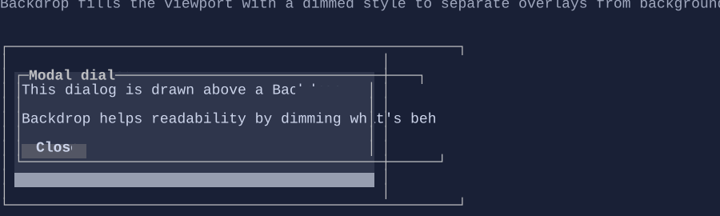

# Backdrop

`Backdrop` is a full-viewport fill control typically used behind modal UI (dialogs, popups) to dim or clear the
content underneath.



It renders a solid rune (space by default) across its bounds using the style resolved from `BackdropStyle`.

Key points:

- It is **stretched by default** (`HorizontalAlignment = Align.Stretch` / `VerticalAlignment = Align.Stretch`).
- It is commonly placed as the first child of a `ZStack` to provide a surface behind overlay content.
- The fill style writes an explicit foreground so nested content that “inherits” colors (e.g. `TextBlockStyle.Default`)
  does not accidentally pick up foreground colors from whatever was rendered underneath.

## Defaults

- Default alignment: `HorizontalAlignment = Align.Stretch`, `VerticalAlignment = Align.Stretch` 

## Styling
`Backdrop` uses `BackdropStyle` from the visual environment.

- `BackdropStyle.Default` is intended for modal dimming (it uses a dim text attribute and a theme-derived background).
- `BackdropStyle.ThemeBackground` fills using the current theme background (useful as a generic background clearer for
  locally-themed regions).

## Example

```csharp
var overlay = new ZStack(
    new Backdrop(),
    new Dialog().Title("Modal").Content("Hello"));
```

## Related

- [Dialog](dialog.md)
- [Popup](popup.md)
- [Styling](../styling.md)
