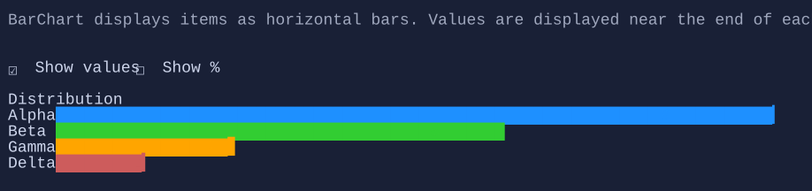

# BarChart

`BarChart` renders a horizontal bar chart with a label column and a bar column. When enabled, the value text is
rendered near the end of the filled portion of each bar (instead of being flush-right at the end of the chart).


{.terminal}

## Basic usage

```csharp
var chart = new BarChart()
    .Title("Distribution")
    .Minimum(0)
    .Maximum(10)
    .ShowValues(true)
    .ShowPercentages(false)
    .Items(
        new BarChartItem("Alpha", 8),
        new BarChartItem("Beta", 5),
        new BarChartItem("Gamma", 2),
        new BarChartItem("Delta", 1));
```

## Items

Items are stored in `BarChart.Items` as `BarChartItem` objects:

- `BarChartItem.Label`: a visual displayed in the left column (you can use `"Text"`, `Markup`, an `HStack` with an icon, etc.).
- `BarChartItem.Value`: numeric value used to compute bar fill.
- `BarChartItem.ValueLabel`: optional explicit value label visual. When set, it is positioned near the end of the bar.
- `BarChartItem.BarColor`: optional bar color override.

## Range

By default, the chart derives bounds from items (`Minimum = 0`, `Maximum = max(item.Value)`). You can override this via:

- `BarChart.Minimum`
- `BarChart.Maximum`

## Defaults

- Default alignment: `HorizontalAlignment = Align.Stretch`, `VerticalAlignment = Align.Start` 

## Styling
The chart is styled via `BarChartStyle`:

- `Padding`: padding around the grid.
- `RowSpacing`: spacing between rows.
- `BarStyle`: progress bar style used for each bar row.
- `DefaultBarColors`: optional palette used when items do not provide `BarColor`.

`BarChartStyle.ValueTextStyle` can be used to customize the default value text (when `BarChartItem.ValueLabel` is not set).

## Related

- [BarChart Specs](../specs/controls/barchart.md)
