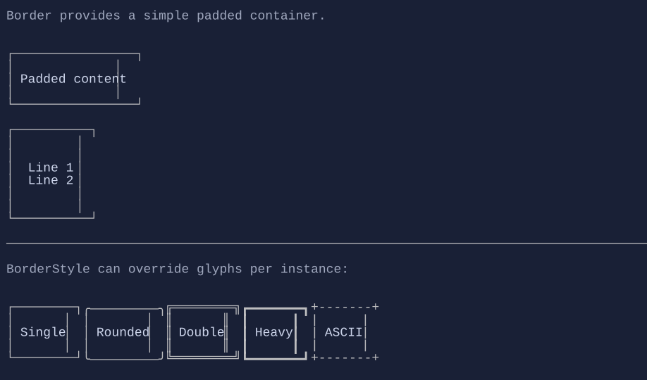

# Border

`Border` draws a border around a single content visual.


{.terminal}

## Basic usage

```csharp
new Border(new TextArea("TextArea inside a Border"));
```

## Per-control border style

You can override the border glyphs and border colors on a per-border basis using `BorderStyle`:

```csharp
using XenoAtom.Terminal.UI.Styling;

new Border("Rounded").Style(BorderStyle.Rounded);
```

## Dynamic content

Use the factory constructor to dynamically recompute content:

```csharp
new Border(() => new TextBlock(DateTime.Now.ToString("T")));
```

## Notes

- `Border` is a layout container: the border consumes space around its content.
- For a labeled frame, see `Group`.

## Defaults

- Default alignment: `HorizontalAlignment = Align.Start`, `VerticalAlignment = Align.Start` 

## Related
- [Group](group.md)
- [Styling](../styling.md)
- [Border Specs](../specs/controls/border.md)
