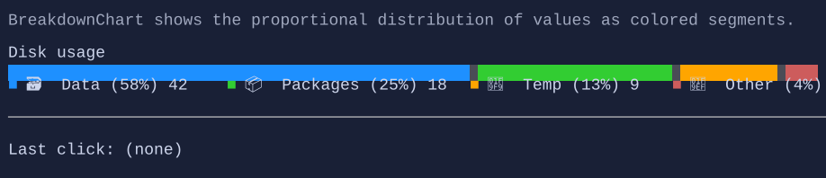

# BreakdownChart

`BreakdownChart` renders a segmented proportional bar (a “breakdown”) with an optional legend. It is useful for showing how
a total value is distributed across categories (disk usage, budgets, KPIs, resource usage, etc.).


{.terminal}

## Basic usage

```csharp
var breakdown = new BreakdownChart()
    .Title("Disk usage")
    .ShowValues(true)
    .ShowPercentages(true)
    .Segment(42, "🗃️  Data", tooltip: new Markup("[primary]Data[/] files and databases."))
    .Segment(18, "📦  Packages", tooltip: new Markup("[success]Packages[/] in the cache."))
    .Segment(9,  "🧹  Temp", tooltip: new Markup("[warning]Temporary[/] files."))
    .Segment(3,  "🧯  Other", tooltip: new Markup("[error]Other[/] space usage."));
```

## Segments

Segments are stored in `BreakdownChart.Segments` as `BreakdownSegment` objects.

- `BreakdownSegment.Value`: numeric value used to compute proportions.
- `BreakdownSegment.Label`: a visual shown in the legend (use a `TextBlock`, `Markup`, an `HStack` with an icon, etc.).
- `BreakdownSegment.Color`: optional segment fill color; when not provided, the control cycles through theme tones.
- `BreakdownSegment.Tooltip`: optional tooltip content shown when hovering the segment in the bar.

For convenience, you can append segments fluently using `BreakdownChartExtensions.Segment(...)` as shown above.

## Interaction

`BreakdownChart` raises a routed `SegmentClicked` event when the user clicks a segment:

```csharp
breakdown.SegmentClicked((_, e) =>
{
    Terminal.WriteLine($"Clicked segment {e.Index}: {e.Segment.Value}");
});
```

## Layout

- `BreakdownChart.Title`: optional title shown above the bar.
- `BreakdownChart.LegendPlacement`: `Above` or `Below` (default: `Below`).
- `BreakdownChart.ShowValues` / `BreakdownChart.ShowPercentages`: controls legend value display.

## Defaults

- Default alignment: `HorizontalAlignment = Align.Stretch`, `VerticalAlignment = Align.Start` 

## Styling
`BreakdownChart` is styled via `BreakdownStyle`:

- `FillRune`: rune used to fill the bar (default is a space with colored backgrounds).
- `SegmentGap`: number of empty cells between segments.
- `LegendLayout`: compact (wrap) or expanded (one item per line).
- `LegendItemSpacing`: spacing between legend items when using the compact layout.
- `LegendJustify`: how leftover space is distributed along each compact legend line.
- `BarStyle`: optional base style applied to bar cells.
- `DefaultSegmentColors`: optional palette used when a segment does not provide an explicit `Color`.

Example:

```csharp
breakdown.Style(new BreakdownStyle
{
    SegmentGap = 0,
});
```
