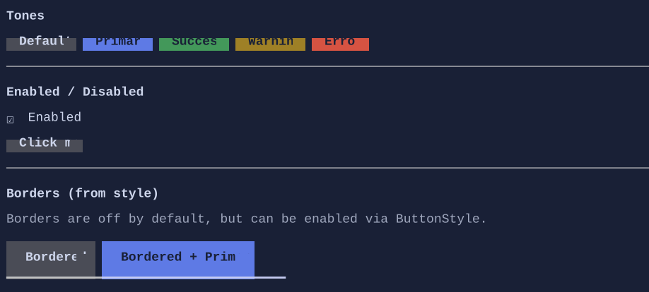

# Button

`Button` is a clickable control that renders a label/content and raises a click interaction via a routed event.


{.terminal}

## Basic usage

```csharp
new Button("Click me")
    .Click(() => Terminal.WriteLine("Clicked"));
```

## Content

Buttons are content controls. The content can be any `Visual`:

```csharp
new Button().Content(new HStack("Save", new Spinner()))
```

## Interaction

- Keyboard: typically activated with Enter/Space when focused.
- Mouse: click/press/release is tracked; mouse capture prevents hover/press from “leaking” to other controls.

## Defaults

- Default alignment: `HorizontalAlignment = Align.Start`, `VerticalAlignment = Align.Start` 

## Styling
Use `ButtonStyle` to control:

- tone (default/primary/success/warning/error)
- padding
- background/foreground for normal/hover/pressed/disabled
- optional decorative border glyphs (Button keeps a custom border because it has a specialized rendering)

```csharp
new Button("Danger")
    .Style(ButtonStyle.Default with { Tone = ControlTone.Error });
```

See also:

- [Styling](../styling.md)
- [Commands](../commands.md)
- [Binding](../binding.md)
