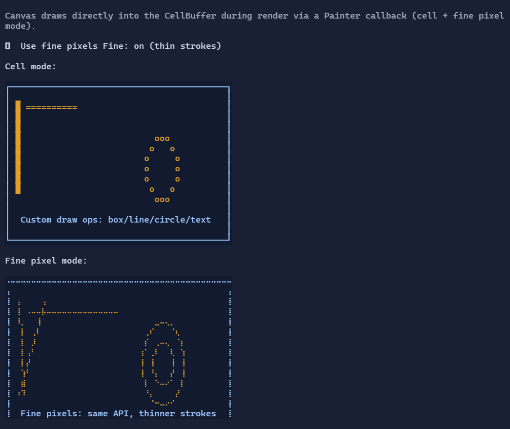

# Canvas

`Canvas` is an immediate-mode drawing surface for cell-based terminal graphics.


{.terminal}

## Basic usage

Provide a `Painter` callback that draws into a `CanvasContext`:

```csharp
new Canvas()
    .MinWidth(40).MaxWidth(40)
    .MinHeight(10).MaxHeight(10)
    .Painter(ctx =>
    {
        ctx.Clear();
        ctx.DrawBox(0, 0, ctx.Size.Width, ctx.Size.Height, LineGlyphs.Single, CellStyle.None);
        ctx.DrawLine(1, 1, 30, 8, new Rune('*'), CellStyle.None);
        ctx.WriteText(2, 2, "Hello Canvas!");
    });
```

## Drawing primitives

`CanvasContext` provides common primitives:

- `SetPixel`
- `DrawHLine` / `DrawVLine`
- `DrawLine`
- `FillRect` / `DrawRect`
- `DrawBox` (corner/edge glyphs via `LineGlyphs`)
- `DrawCircle`
- `WriteText`

## Fine pixels (thin drawing)

Set `UseFinePixels` to render default-rune primitives (e.g. `DrawLine(..., style)` / `DrawCircle(..., style)`) using a
sub-cell dot grid for thinner strokes:

```csharp
new Canvas()
    .UseFinePixels(true)
    .Painter(ctx =>
    {
        ctx.Clear();
        ctx.DrawLine(1, 1, 30, 8, Style.None);
        ctx.DrawCircle(20, 6, 4, Style.None);
    });
```

Cell-based operations like `FillRect` and `WriteText` remain cell-based.

## Defaults

- Default alignment: `HorizontalAlignment = Align.Stretch`, `VerticalAlignment = Align.Stretch` 

## Styling
`CanvasStyle` controls the default rune and style used by primitives when you don't pass them explicitly:

```csharp
new Canvas()
    .Style(CanvasStyle.Default with { DefaultRune = new Rune('█') });
```

## Related

- [Canvas Specs](../specs/controls/canvas.md)
