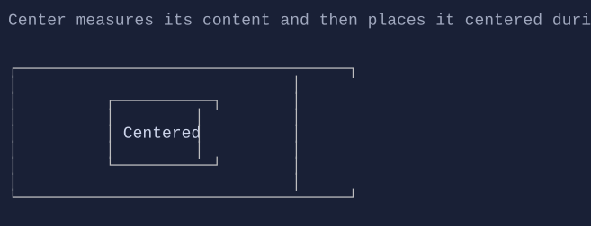

# Center

`Center` centers its content within the available space.




## Basic usage

```csharp
new Center(new Button("OK"));
```


## Defaults

- Default alignment: `HorizontalAlignment = Align.Start`, `VerticalAlignment = Align.Start` 
