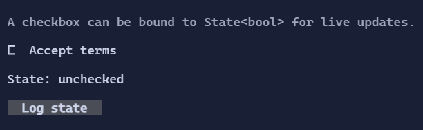

# CheckBox

`CheckBox` is a two-state toggle control (checked/unchecked) with a label/content.


{.terminal}

## Basic usage

```csharp
var accepted = new State<bool>(false);

new CheckBox("Accept terms")
    .IsChecked(accepted);
```

To react imperatively when the value changes, use the routed `ValueChanged` event:

```csharp
new CheckBox("Accept terms")
    .ValueChanged((_, e) => Console.WriteLine($"Checked: {e.NewValue}"));
```

## Content & spacing

The label can be a `Visual`, and spacing between glyph and label is controlled by `CheckBoxStyle`.

## Interaction

- `Space` / `Enter`: toggle when focused.
- Mouse click: toggle.
- `ValueChanged`: raised when `IsChecked` changes.

## Defaults

- Default alignment: `HorizontalAlignment = Align.Start`, `VerticalAlignment = Align.Start` 

## Styling
`CheckBoxStyle` controls glyphs, spacing, and colors for normal/hover/focused/disabled states.

## Related

- [Binding](../binding.md)
- [Styling](../styling.md)
- [CheckBox Specs](../specs/controls/checkbox.md)
