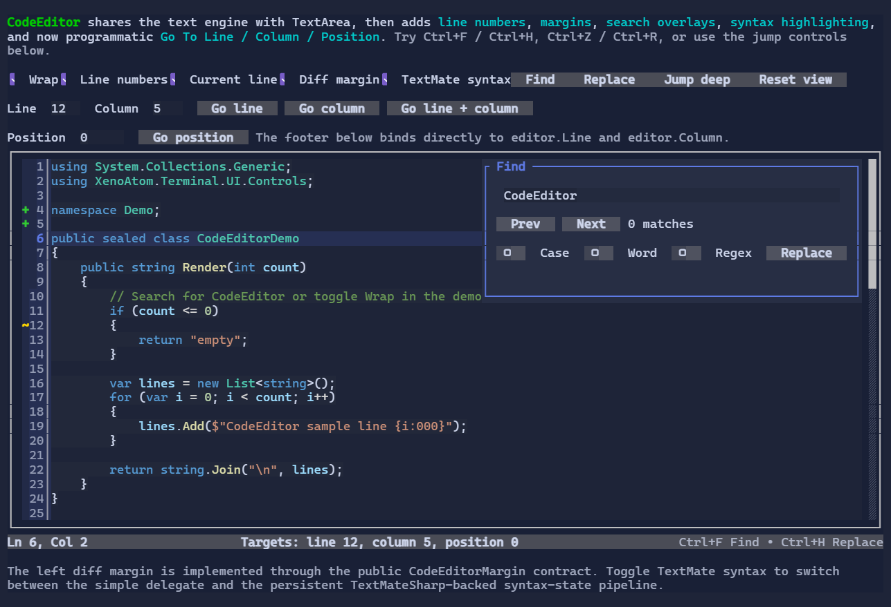

# CodeEditor

`CodeEditor` is a code-oriented multi-line editor built on top of the shared `TextEditorBase` / `TextEditorCore` stack.

It keeps the core text-editing behavior of `TextArea`-selection, clipboard, undo/redo, scrolling, and Find/Replace-then adds:

- adaptive line numbers enabled by default,
- pluggable left/right margins,
- current-line styling,
- a simple line-based highlighting delegate,
- an advanced persistent syntax-highlighting pipeline with optional async computation.

{.terminal}

## Basic usage

```csharp
var editor = new CodeEditor("public sealed class Demo { }")
    .MinHeight(10)
    .MaxHeight(10);
```

To bind the editor text to a `State<string?>`:

```csharp
var code = new State<string?>("return 42;");

new CodeEditor()
    .Text(code);
```

## Built-in editing behavior

`CodeEditor` inherits the shared editor behavior from `TextEditorBase`:

- caret navigation and selection,
- clipboard shortcuts (`Ctrl+C`, `Ctrl+X`, `Ctrl+V`),
- undo/redo (`Ctrl+Z`, `Ctrl+R`),
- integrated Find/Replace (`Ctrl+F`, `Ctrl+H`),
- scroll integration through `IScrollable` / `ScrollModel`.

This means `CodeEditor` behaves like a specialized `TextArea`, not a separate editing subsystem.

## Go To Line / Column / Position

`CodeEditor` exposes programmatic navigation helpers:

```csharp
editor.GoToLine(42);          // one-based line, column 1
editor.GoToColumn(8);         // one-based column on the current line
editor.GoToLine(42, 8);       // one-based line + column
editor.GoToPosition(128);     // zero-based UTF-16 document position
editor.GoToPosition(new TextPosition(128));
```

Line and column navigation use one-based values because they are intended to match the numbers users typically see in
editor gutters and status bars. Requests are clamped to the current document bounds.

For status bars and other bindings, `CodeEditor` also exposes readable bindable caret-location properties:

```csharp
new Footer()
    .Left(new TextBlock(() => $"Ln {editor.Line}, Col {editor.Column}"));
```

`Line` and `Column` are one-based and update automatically as the caret moves.

## Line numbers

Line numbers are enabled by default:

```csharp
new CodeEditor(text)
    .ShowLineNumbers(true)
    .MinLineNumberDigits(2);
```

The default gutter is adaptive:

- numbers are rendered only on the first wrapped row of a logical line,
- continuation wrapped rows stay blank,
- gutter width is based on the visible line range instead of the total document size,
- width changes only when the visible digit bucket changes.

## Search / Replace

Like `TextArea`, `CodeEditor` hosts the reusable `SearchReplacePopup`:

- `Ctrl+F`: Find
- `Ctrl+H`: Replace

You can also open the popup programmatically:

```csharp
editor.OpenFind("TODO");
editor.OpenReplace("var");
```

Search matches are rendered as overlays on top of the syntax-highlighted text.

## Simple syntax highlighting

For small languages, demos, or lightweight classification, use the `Highlighter` delegate:

```csharp
new CodeEditor(source)
    .Highlighter((in CodeEditorLineHighlightRequest request, List<StyledRun> runs) =>
    {
        var line = request.Snapshot.GetLine(request.LineIndex);
        if (line.Length >= 6)
        {
            runs.Add(new StyledRun(0, 6, Style.None.WithForeground(Colors.DeepSkyBlue)));
        }
    });
```

Runs are line-relative, not wrap-relative. `CodeEditor` intersects them with only the visible wrapped segments.

## Advanced syntax highlighting

For large files or incremental tokenization, provide a `CodeEditorSyntaxHighlighter`:

```csharp
public sealed class DemoSyntaxHighlighter : CodeEditorSyntaxHighlighter
{
    public override CodeEditorSyntaxState Build(in CodeEditorSyntaxBuildContext context)
        => new DemoState(context.Snapshot.Version);

    public override CodeEditorSyntaxState Update(CodeEditorSyntaxState previousState, in CodeEditorSyntaxUpdateContext context)
        => new DemoState(context.Snapshot.Version);

    public override void GetLineRuns(CodeEditorSyntaxState state, in CodeEditorLineSyntaxRequest request, List<StyledRun> runs)
    {
        // Return StyledRun values relative to request.LineStart/request.LineLength.
    }
}

new CodeEditor(source)
    .SyntaxHighlighter(new DemoSyntaxHighlighter());
```

Key points:

- syntax state is associated with a snapshot version,
- viewport width changes rewrap the editor without rebuilding syntax state,
- pure scrolling only requests visible logical lines,
- stale async results are discarded.

If your highlighter can work off the UI thread, also implement `IAsyncCodeEditorSyntaxHighlighter`.

## TextMateSharp integration

For full grammar-based highlighting, use the companion package:

```shell
dotnet add package XenoAtom.Terminal.UI.Extensions.CodeEditor.TextMateSharp
```

Then attach the bundled TextMateSharp-backed highlighter:

```csharp
using XenoAtom.Terminal.UI.Extensions.CodeEditor.TextMateSharp;

var editor = new CodeEditor(source)
{
    SyntaxHighlighter = new TextMateCodeEditorSyntaxHighlighter(
        new TextMateCodeEditorOptions
        {
            LanguageId = "csharp",
        }),
};
```

You can also resolve grammars from a file name or extension:

```csharp
var highlighter = new TextMateCodeEditorSyntaxHighlighter(
    new TextMateCodeEditorOptions
    {
        FileName = "program.cs",
    });
```

The TextMateSharp integration keeps incremental per-line tokenizer state so edits only need to recompute the affected
suffix of the document, while rendering colors are resolved from bundled light and dark TextMate themes according to
the active terminal UI theme.

## Pluggable margins

Margins are non-visual extension points that render beside the text surface:

```csharp
var diffMargin = CodeEditor.CreateDiffIndicatorMargin(
    lineIndex => lineIndex switch
    {
        3 => new Rune('+'),
        4 => new Rune('+'),
        10 => new Rune('~'),
        _ => null,
    },
    lineIndex => lineIndex < 10
        ? Style.None.WithForeground(Colors.LimeGreen) | TextStyle.Bold
        : Style.None.WithForeground(Colors.Gold) | TextStyle.Bold);

var editor = new CodeEditor(source);
editor.LeftMargins.Insert(0, diffMargin);
```

Margins receive:

- the visible wrapped-row mapping,
- the owning logical line,
- first-row-of-line information,
- theme/style access,
- pointer-routing support.

This allows features such as line numbers, diff markers, diagnostics, breakpoints, or custom annotations without making margins into `Visual`s.

## Styling

Use `CodeEditorStyle` to customize the editor surface, gutter, current-line highlight, and search overlays:

```csharp
new CodeEditor(source)
    .Style(CodeEditorStyle.Default with
    {
        CurrentLineBackground = Colors.DeepSkyBlue.WithAlpha(0x22),
        SearchMatchBackground = Colors.Gold.WithAlpha(0x30),
        ActiveSearchMatchBackground = Colors.Orange,
        ShowMarginSeparators = true,
    });
```

## Scroll integration

`CodeEditor` implements `IScrollable`, so it integrates naturally with `ScrollViewer`:

```csharp
new ScrollViewer(new CodeEditor(longSource).MinHeight(12).MaxHeight(12));
```

The gutter does not horizontally scroll with the text surface.

## See also

- [Text Editing](../text-editing.md)
- [TextArea](textarea.md)
- [PromptEditor](prompteditor.md)
- [SearchReplacePopup](searchreplacepopup.md)
- [Undo/Redo](../undo-redo.md)
- [Code Editor Specs](../specs/code_editor_specs.md)
