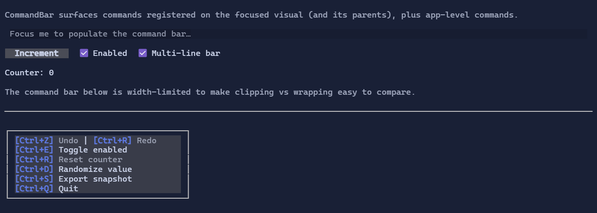

# CommandBar

`CommandBar` displays a “key hints” strip for the current focus context.

It collects `Command` instances registered on the focused visual (and its parents) plus app-level commands, then renders
them as a sequence of keycaps and labels.

{.terminal}

## Example

```csharp
using XenoAtom.Terminal;
using XenoAtom.Terminal.UI;
using XenoAtom.Terminal.UI.Controls;
using XenoAtom.Terminal.UI.Input;

var editor = new TextArea("Try Ctrl+Z / Ctrl+R / Ctrl+F");

var root = new DockLayout()
    .Content(editor)
    .Bottom(new VStack(
        new CommandBar(),
        new Footer().Left("Tab focus | Mouse").Right("Ctrl+Q quit"))
        .Spacing(0));

Terminal.Run(root);
```

## Multi-line wrapping

By default, `CommandBar` keeps the existing single-row behavior and clips entries that do not fit.

If you want commands to wrap onto additional rows instead, enable `MultiLine`:

```csharp
var bar = new CommandBar()
    .MultiLine(true);
```

In multi-line mode, a command entry is moved to the next row when it does not fit in the remaining space on the current row.
The default remains `false`.

## Defaults

- Default alignment: `HorizontalAlignment = Align.Start`, `VerticalAlignment = Align.Start` 
- `MultiLine = false`

## Styling
Use `CommandBarStyle` to change bar/keycap colors:

```csharp
using XenoAtom.Terminal.UI.Styling;

var bar = new CommandBar()
    .Style(CommandBarStyle.Default with
    {
        Background = Colors.Black,
        KeyForeground = Colors.Primary,
        Separator = " · ",
    });
```

## See also

- [Commands](../commands.md)
- [Command Specs](../specs/command_specs.md)
- [Input](../input.md)

## Related

- [CommandBar Specs](../specs/controls/commandbar.md)
