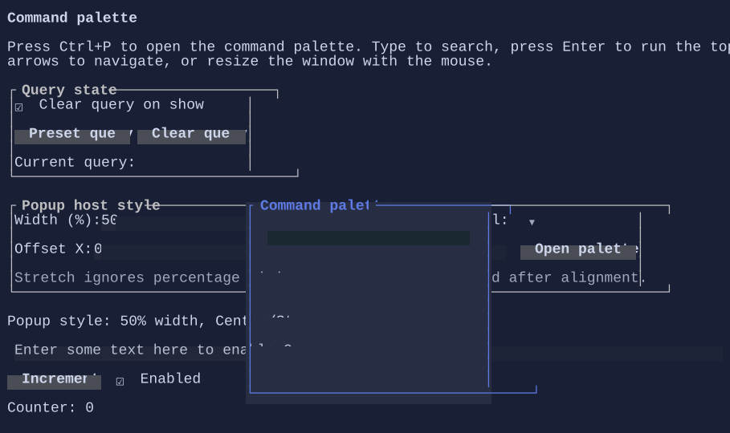

# CommandPalette

`CommandPalette` is a searchable command launcher built on top of the unified `Command` system.


{.terminal}

## Fullscreen-only

`CommandPalette` uses the window layer and is available only in fullscreen `Terminal.Run(...)` applications.

## What it shows

`CommandPalette` lists commands discovered from the current focus context:

- Commands registered on the focused visual and its ancestors
- Global commands registered on the running `TerminalApp`

Only commands marked with `CommandPresentation.CommandPalette` are shown.

## Typical usage

Create a palette instance and register a command that opens it:

```csharp
using XenoAtom.Terminal;
using XenoAtom.Terminal.UI.Commands;
using XenoAtom.Terminal.UI.Controls;
using XenoAtom.Terminal.UI.Input;

var palette = new CommandPalette();

root.AddCommand(new Command
{
    Id = "App.CommandPalette",
    LabelMarkup = "Command palette",
    Gesture = new KeyGesture(TerminalChar.CtrlP, TerminalModifiers.Ctrl),
    Presentation = CommandPresentation.CommandBar | CommandPresentation.CommandPalette,
    Execute = _ => palette.Show(),
});
```

When open:

- Type to search
- Press Enter to execute the currently highlighted result (the first match by default)
- Use Up/Down to navigate results
- Press Down from the search box to move directly to the next result
- Resize or drag the palette window with the mouse
- Press Esc to close
- Closing the palette returns focus to the control that was focused before `Show()`

## Host chrome

When displayed via `CommandPalette.Show()`, the palette is hosted inside a resizable dialog window. The host dialog takes
care of restoring the previous focus when the palette closes. The built-in palette chrome uses a recessed search field and a
lifted active-row surface so the current focus stands out from the surrounding dialog panel. You can still wrap the palette content with a template visual
using `CommandPaletteStyle`:

```csharp
using XenoAtom.Terminal.UI.Controls;
using XenoAtom.Terminal.UI.Styling;

var palette = new CommandPalette();
palette.Style(CommandPaletteStyle.Default with
{
    PopupTemplateFactory = visual => new Border(visual),
});
```

## Defaults

- Default alignment: `HorizontalAlignment = Align.Start`, `VerticalAlignment = Align.Start` 

## Related
- [Commands](../commands.md)
- [Input](../input.md)
- [CommandBar](commandbar.md)
- [Dialog](dialog.md)
- [CommandPalette Specs](../specs/controls/commandpalette.md)
