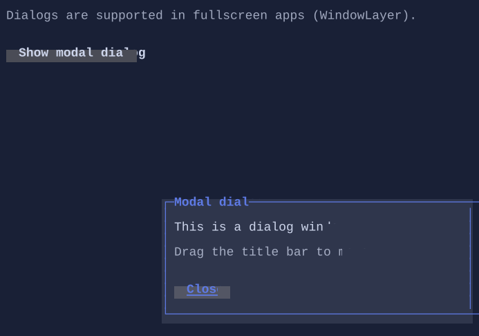

# Dialog

`Dialog` is a movable, resizable window-like overlay used in fullscreen apps.


{.terminal}

## Usage

Dialogs are displayed in fullscreen apps and typically:

- take focus when shown
- can be modal or non-modal depending on configuration
- can be moved by dragging the top border row
- highlights the top border row on hover so the move affordance is visible
- can be resized from the left, right, bottom, and bottom-right handles
- can be closed via an action (e.g. Close button)

## Features

- Resize handles are enabled by default via `IsResizable`.
- Minimum interactive size uses the inherited `MinWidth` and `MinHeight` properties.
- `TopRightText`, `BottomLeftText`, and `BottomRightText` let you decorate the dialog border the same way `Group` does.
- `DialogStyle` lets you override border glyphs, surface/border styles, label cutout styling, and the hover styling used for resize handles and the move bar.

```csharp
var dialog = new Dialog()
    .Title("Settings")
    .TopRightText("Resizable")
    .BottomLeftText("Min 40x10")
    .BottomRightText("Drag edge")
    .MinWidth(40)
    .MinHeight(10)
    .Content("Dialog body")
    .Style(DialogStyle.Rounded with
    {
        ResizeHandleHoverStyle = Style.None.WithBackground(Colors.DeepSkyBlue.WithAlpha(0x40)),
    });
```

## Defaults

- Default alignment: `HorizontalAlignment = Align.Stretch`, `VerticalAlignment = Align.Stretch`
- Default resize behavior: `IsResizable = true`

See also:
- [Popup](popup.md)
- [Backdrop](backdrop.md)
- [Input](../input.md)

## Related

- [Dialog Specs](../specs/controls/dialog.md)
