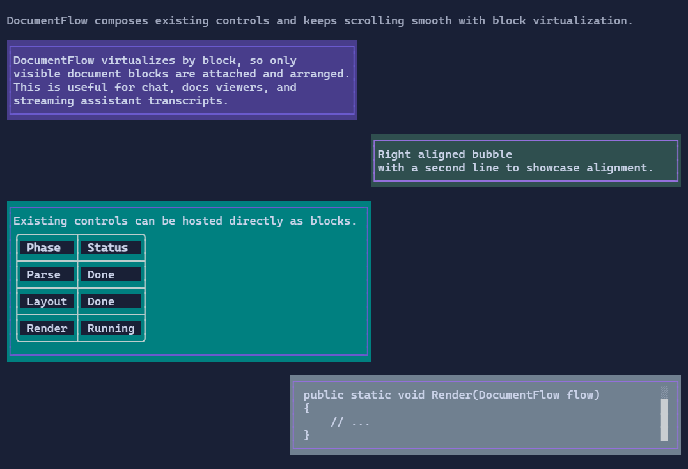

# DocumentFlow

`DocumentFlow` is a virtualized, scrollable feed of document items.
Each item is composed from blocks (paragraphs, tables, code blocks, or any visual-backed block).

{.terminal}

## Basic usage

```csharp
var flow = new DocumentFlow();

flow.Items.Add(new DocumentFlowItem
{
    Content = new FlowDocument()
        .AddParagraph("Hello from DocumentFlow"),
    Alignment = DocumentFlowAlignment.Left,
    MaxWidthPercent = 60,
});
```

`MaxWidthPercent` is evaluated from the available viewport width.
If both `MaxWidth` and `MaxWidthPercent` are provided, the most restrictive width is used.

## Conversation-style alignment

```csharp
flow.Items.Add(new DocumentFlowItem
{
    Content = new FlowDocument().AddParagraph("Left bubble"),
    Alignment = DocumentFlowAlignment.Left,
    MaxWidthPercent = 65,
});

flow.Items.Add(new DocumentFlowItem
{
    Content = new FlowDocument().AddParagraph("Right bubble"),
    Alignment = DocumentFlowAlignment.Right,
    MaxWidthPercent = 65,
});
```

## Mixed block content

```csharp
var table = new Table()
    .Headers("Key", "Value")
    .AddRow("Mode", "Fast");

var log = new LogControl().MaxHeight(4);
log.AppendLine("code: Console.WriteLine(\"Hello\")");

var document = new FlowDocument()
    .AddParagraph("Mixed content item")
    .Add(table)
    .Add(log);
```

## Follow-tail

`DocumentFlow` follows the tail by default for append-heavy feeds.

```csharp
flow.FollowTail = false;   // disable auto-follow, even if the viewport is already at the tail
flow.FollowTail = true;    // re-enable auto-follow for subsequent appends
flow.ScrollToTail();       // enable follow-tail and jump to the end
flow.ScrollToTail(false);  // disable follow-tail (keeps current viewport)
```

When `FollowTail` is `false`, appending new items keeps the current viewport stable instead of advancing to the new tail.
Use `ScrollToTail()` when you want to immediately jump to the current tail and keep following afterwards.

## Scroll to a specific item

Use item indexes to jump to a specific `DocumentFlowItem`.

```csharp
flow.ScrollToItem(42);       // throws if the index is invalid

if (!flow.TryScrollToItem(99))
{
    // index not found
}
```

`ScrollToItem` disables follow-tail mode, so subsequent appends do not force scrolling.

Use `MaxCapacity` to keep memory bounded for long-running sessions.

## Related

- [MarkdownControl](markdowncontrol.md)
- [Paragraph](paragraph.md)
- [Table](table.md)
- [LogControl](logcontrol.md)
- [DocumentFlow Specs](../specs/controls/documentflow.md)
