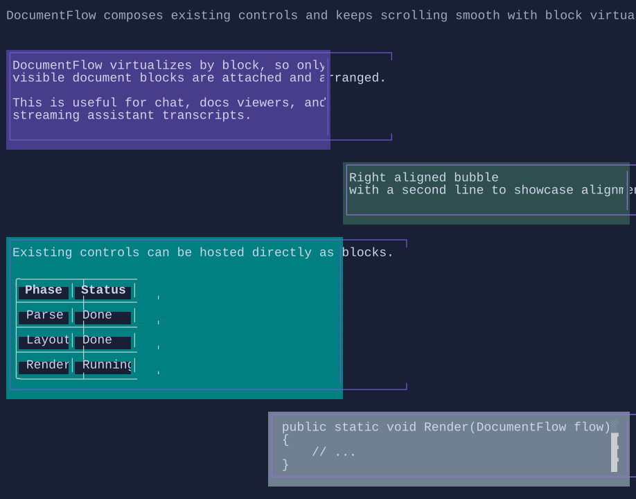

# DocumentFlow

`DocumentFlow` is a virtualized, scrollable feed of document items.
Each item is composed from blocks (paragraphs, tables, code blocks, or any visual-backed block).

{.terminal}

## Basic usage

```csharp
var flow = new DocumentFlow();

flow.Items.Add(new DocumentFlowItem
{
    Content = new FlowDocument()
        .AddParagraph("Hello from DocumentFlow"),
    Alignment = DocumentFlowAlignment.Left,
    MaxWidth = 48,
});
```

## Conversation-style alignment

```csharp
flow.Items.Add(new DocumentFlowItem
{
    Content = new FlowDocument().AddParagraph("Left bubble"),
    Alignment = DocumentFlowAlignment.Left,
    MaxWidth = 48,
});

flow.Items.Add(new DocumentFlowItem
{
    Content = new FlowDocument().AddParagraph("Right bubble"),
    Alignment = DocumentFlowAlignment.Right,
    MaxWidth = 48,
});
```

## Mixed block content

```csharp
var table = new Table()
    .Headers("Key", "Value")
    .AddRow("Mode", "Fast");

var log = new LogControl().MaxHeight(4);
log.AppendLine("code: Console.WriteLine(\"Hello\")");

var document = new FlowDocument()
    .AddParagraph("Mixed content item")
    .Add(table)
    .Add(log);
```

## Follow-tail

`DocumentFlow` follows the tail by default for append-heavy feeds.

```csharp
flow.ScrollToTail();
```

Use `MaxCapacity` to keep memory bounded for long-running sessions.

## Related

- [Paragraph](paragraph.md)
- [Table](table.md)
- [LogControl](logcontrol.md)
- [DocumentFlow Specs](../specs/controls/documentflow.md)
