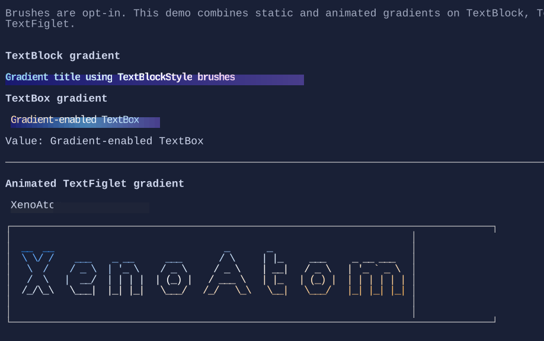

# Gradients

`Brush` adds gradient-based coloring for selected controls without changing the core per-cell `Style` model.

{.terminal}

Current controls with direct brush support:

- `TextBlock` (`TextBlockStyle.ForegroundBrush`, `TextBlockStyle.BackgroundBrush`)
- `TextFiglet` (`TextFigletStyle.ForegroundBrush`, `TextFigletStyle.BackgroundBrush`)
- `TextBox` (`TextBoxStyle.ForegroundBrush`, `TextBoxStyle.BackgroundBrush`)

## TextBox gradient example

```csharp
var backgroundBrush = Brush.LinearGradient(
    new GradientPoint(0f, 0f),
    new GradientPoint(1f, 0f),
    [
        new GradientStop(0f, Color.Rgb(0x11, 0x25, 0x3D)),
        new GradientStop(0.5f, Color.Rgb(0x1D, 0x3F, 0x62)),
        new GradientStop(1f, Color.Rgb(0x12, 0x20, 0x33)),
    ]);

var foregroundBrush = Brush.LinearGradient(
    new GradientPoint(0f, 0f),
    new GradientPoint(1f, 0f),
    [
        new GradientStop(0f, Color.Rgb(0xFF, 0xE0, 0xA3)),
        new GradientStop(0.5f, Color.Rgb(0xFF, 0xFF, 0xFF)),
        new GradientStop(1f, Color.Rgb(0x8B, 0xD4, 0xFF)),
    ]);

new TextBox("Gradient-enabled TextBox")
    .Style(TextBoxStyle.Default with
    {
        BackgroundBrush = backgroundBrush,
        ForegroundBrush = foregroundBrush,
    });
```

## Animated TextFiglet sweep

```csharp
new TextFiglet("XenoAtom")
    .Style(() =>
    {
        var pulse = runtime.Pulse01.Value;
        var sweepBrush = Brush.LinearGradient(
            new GradientPoint(-0.40f + pulse, 0f),
            new GradientPoint(0.40f + pulse, 1f),
            [
                new GradientStop(0f, Color.RgbA(0x44, 0x88, 0xFF, 0x40)),
                new GradientStop(0.5f, Color.Rgb(0xFF, 0xFF, 0xFF)),
                new GradientStop(1f, Color.RgbA(0x44, 0x88, 0xFF, 0x40)),
            ],
            tileMode: BrushTileMode.Mirror,
            mixSpaceOverride: ColorMixSpace.Oklab);

        return TextFigletStyle.Default with { ForegroundBrush = sweepBrush };
    });
```

## Notes

- `Brush` is sampled at render time and converted to concrete per-cell colors.
- The default interpolation space comes from `Theme.GradientMixSpace` (default: `ColorMixSpace.Oklab`).
- Use RGBA stops (`Color.RgbA`) to create translucent sweep/highlight effects.
