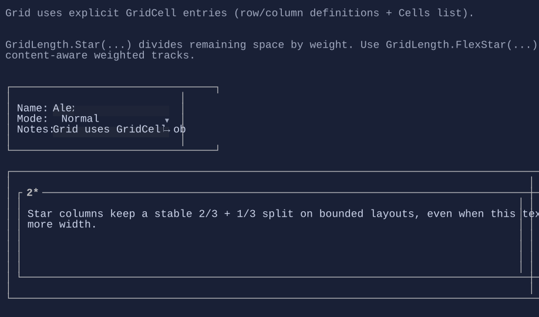

# Grid

`Grid` arranges children into rows and columns using explicit `GridCell` entries (no attached properties).


{.terminal}

## Basic usage

```csharp
new Grid()
    .Columns(new ColumnDefinition(GridLength.Auto), new ColumnDefinition(GridLength.Star))
    .Rows(new RowDefinition(GridLength.Auto), new RowDefinition(GridLength.Auto))
    .Cell("Name:", row: 0, column: 0)
    .Cell(new TextBox("Alex"), row: 0, column: 1);
```

## Star sizing

`GridLength.Star(weight)` is not a fixed ratio split.

- `Auto` and `Star` tracks both start from the natural size of their content.
- `Star` only changes how extra space is distributed after those natural sizes are known.
- When content is wider than the available width, tracks shrink from their natural sizes toward their mins; the star weight does not force a strict `2:1`, `3:1`, etc. split under pressure.

## Proportional sizing

Use `GridLength.Proportional(weight)` when you want a stable weighted split of the remaining space.

```csharp
new Grid()
    .Columns(
        new ColumnDefinition { Width = GridLength.Proportional(2) },
        new ColumnDefinition { Width = GridLength.Proportional(1) })
    .Rows(new RowDefinition { Height = GridLength.Star(1) })
    .Cell(leftPane, row: 0, column: 0)
    .Cell(rightPane, row: 0, column: 1);
```

- `Proportional` tracks start from their mins on bounded axes, then divide the remaining space by weight.
- Child natural size does not bias the ratio unless min/max constraints force it to.
- `GridLength.Fraction(weight)` is an alias for `Proportional(weight)`.

## Spans

Cells can span multiple rows/columns via `rowSpan` / `columnSpan`.


## Defaults

- Default alignment: `HorizontalAlignment = Align.Stretch`, `VerticalAlignment = Align.Stretch` 

## Related

- [Grid Specs](../specs/controls/grid.md)
