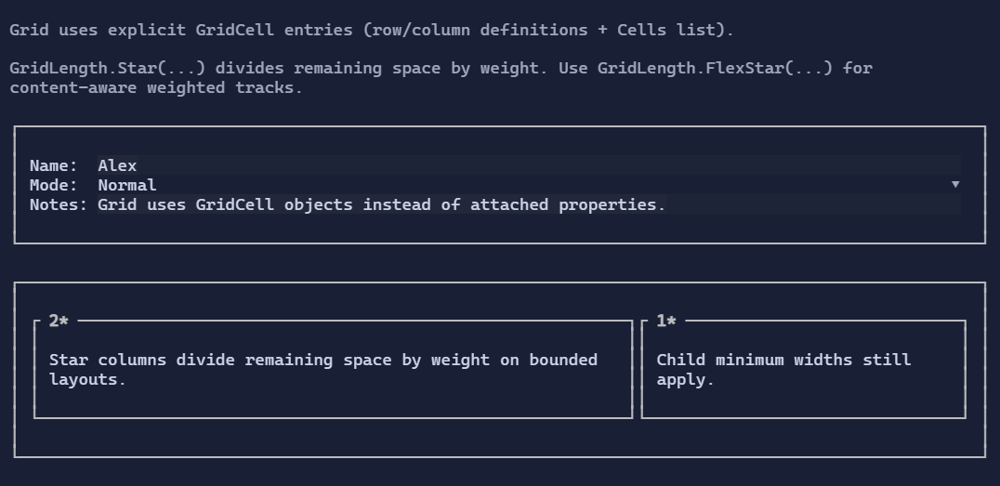

# Grid

`Grid` arranges children into rows and columns using explicit `GridCell` entries (no attached properties).


{.terminal}

## Basic usage

```csharp
new Grid()
    .Columns(
        new ColumnDefinition { Width = GridLength.Auto },
        new ColumnDefinition { Width = GridLength.Star() })
    .Rows(
        new RowDefinition { Height = GridLength.Auto },
        new RowDefinition { Height = GridLength.Auto })
    .Cell("Name:", row: 0, column: 0)
    .Cell(new TextBox("Alex"), row: 0, column: 1);
```

## Star sizing

`GridLength.Star(weight)` divides the remaining bounded space by weight.

- `Auto` tracks measure to content first.
- `Star` tracks start from their mins on bounded axes, then divide the remaining space by weight.
- Child natural size does not bias the ratio unless min/max constraints force it to.
- On bounded axes, a grid with `Star` tracks still reports the bounded allocated width as its natural size, so start-aligned
  parents do not collapse star layouts down to the tracks' minimum widths.

```csharp
new Grid()
    .Columns(
        new ColumnDefinition { Width = GridLength.Star(2) },
        new ColumnDefinition { Width = GridLength.Star(1) })
    .Rows(new RowDefinition { Height = GridLength.Star(1) })
    .Cell(leftPane, row: 0, column: 0)
    .Cell(rightPane, row: 0, column: 1);
```

## FlexStar sizing

Use `GridLength.FlexStar(weight)` when you want a flexible track that preserves child natural size before sharing extra space by weight.

- `FlexStar` is content-aware.
- It is useful for layouts where intrinsic content width should matter, but the track should still grow when extra space exists.

## Spans

Cells can span multiple rows/columns via `rowSpan` / `columnSpan`.


## Defaults

- Default alignment: `HorizontalAlignment = Align.Stretch`, `VerticalAlignment = Align.Stretch` 

## Related

- [Grid Specs](../specs/controls/grid.md)
