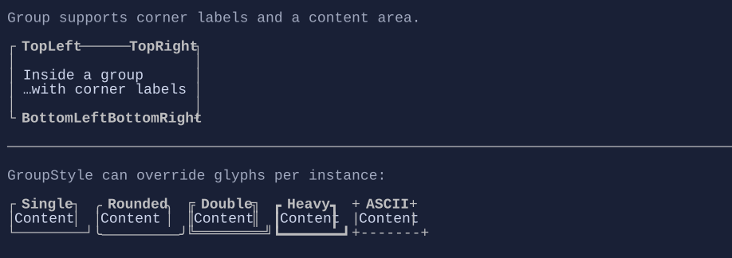

# Group

`Group` is a border-like container with optional corner labels (top-left/top-right/bottom-left/bottom-right).


{.terminal}

## Basic usage

```csharp
new Group("Settings")
    .Content(new VStack(
        new CheckBox("Enabled"),
        new TextBox("Name")
    ));
```

## Per-control border style

You can override the group glyphs and border colors on a per-group basis using `GroupStyle`:

```csharp
using XenoAtom.Terminal.UI.Styling;

new Group("Rounded")
    .Style(GroupStyle.Rounded)
    .Content("Content");
```


## Defaults

- Default alignment: `HorizontalAlignment = Align.Start`, `VerticalAlignment = Align.Start` 
