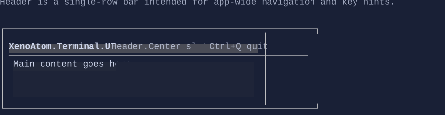

# Header

`Header` is an app-chrome control (top area) that can display left/right aligned content like title, breadcrumbs, and key hints.

`Header` is typically used as the top bar of a `DockLayout`.



## Basic usage

```csharp
var root = new DockLayout()
    .Top(new Header()
        .Left("My App")
        .Right(new CommandBar()))
    .Content(mainContent);
```

## Defaults

- Default alignment: `HorizontalAlignment = Align.Stretch`, `VerticalAlignment = Align.Start`

## Key properties

- `Left`, `Center`, `Right`: slot visuals arranged on a single row

## Related

- [Footer](footer.md)
- [CommandBar](commandbar.md)
- [Layout](../layout.md)
