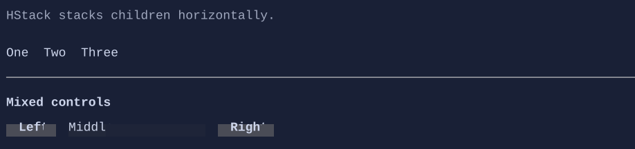

# HStack

`HStack` stacks children horizontally.




## Basic usage

```csharp
new HStack(
    new Button("Left"),
    new Button("Right")
).Spacing(2);
```

## Defaults

- Default alignment: `HorizontalAlignment = Align.Start`, `VerticalAlignment = Align.Stretch` 

## Related
- [Layout](../layout.md)
- [VStack](vstack.md)
