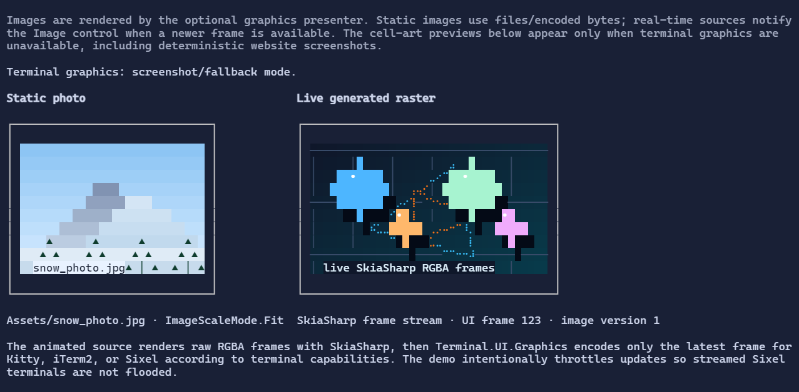

# Image

`Image` is provided by the optional `XenoAtom.Terminal.UI.Graphics` package. It reserves a cell rectangle in a fullscreen or inline UI and asks a graphics presenter to encode and display image content using the terminal's supported graphics protocol.

Supported fullscreen protocols are selected by `TerminalImageGraphicsPresenter`:

- Kitty graphics when available.
- Sixel for terminals that advertise Sixel support.
- iTerm2 inline images as a streamed fallback.

The package uses `XenoAtom.Terminal.Graphics` for image decoding, scaling, and protocol encoding. The public UI API uses neutral image-source abstractions rather than exposing renderer-specific types.

{.terminal}

> [!NOTE]
> The website screenshot is generated by the cell-buffer screenshot exporter, so it shows the `Image` control's fallback previews. Run the ControlsDemo **Images & Graphics** page in a terminal with `TerminalImageGraphicsPresenter` enabled to see the actual terminal image protocols render `Assets/snow_photo.jpg` and the live generated raster.

## Basic usage

```csharp
using XenoAtom.Terminal;
using XenoAtom.Terminal.Graphics;
using XenoAtom.Terminal.UI;
using XenoAtom.Terminal.UI.Controls;
using XenoAtom.Terminal.UI.Graphics;
using UiImageScaleMode = XenoAtom.Terminal.UI.ImageScaleMode;

var image = new Image(TerminalImageSource.FromFile("logo.png"))
{
    CellWidth = 24,
    CellHeight = 12,
    ScaleMode = UiImageScaleMode.Fit,
    PreserveAspectRatio = true,
    AccessibilityText = "Project logo",
    FallbackContent = new TextBlock("[logo]"),
};

Terminal.Run(
    image,
    _ => TerminalLoopResult.Continue,
    new TerminalRunOptions
    {
        GraphicsPresenter = new TerminalImageGraphicsPresenter(),
    });
```

One-shot flow output can write a standalone image directly when the optional graphics package is referenced:

```csharp
Terminal.Write(new Image(TerminalImageSource.FromFile("logo.png"))
{
    CellWidth = 24,
    CellHeight = 12,
    FallbackContent = new TextBlock("[logo]"),
});
```

For composed one-shot visuals, pass a presenter explicitly:

```csharp
Terminal.Write(
    new Border(image).Padding(1),
    new TerminalWriteOptions
    {
        GraphicsPresenter = new TerminalImageGraphicsPresenter(),
    });
```

When `GraphicsPresenter` is not configured, terminal graphics are disabled, or the configured presenter cannot select a supported protocol, `Image` displays `FallbackContent` if provided. Inline/live regions can also opt in by setting `TerminalLiveOptions.GraphicsPresenter`.

## Real-time sources

For generated frames, charts, camera-like sources, or other repeatedly updated raster content, implement `ITerminalRealtimeImageSource` on a `TerminalImageSource`. The source raises `FrameAvailable` when a newer frame exists; `Image` coalesces notifications through the app dispatcher and asks the graphics presenter to render the latest frame without requiring a layout invalidation.

The presenter caches encoded images by source identity/version, target size, terminal pixel metrics, and encoder options.
Static images may still be redrawn when text underneath a streamed protocol region repaints, but the cached payload avoids
re-decoding, re-rasterizing, and re-quantizing the immutable source. For Sixel, Floyd-Steinberg dithering is off by default
because it is substantially more expensive than nearest-palette quantization; turn it on only when the quality difference
is worth the encode cost.

When Windows Terminal/Sixel throughput matters more than adaptive palette quality, configure the presenter with the fixed RGB332 palette fast path:

```csharp
new TerminalImageGraphicsPresenter(new TerminalImageGraphicsPresenterOptions
{
    Protocol = TerminalGraphicsProtocol.Sixel,
    SixelOptions = new TerminalSixelEncoderOptions
    {
        PaletteMode = TerminalSixelPaletteMode.FixedRgb332,
        EnableDithering = false,
    },
});
```

`TerminalImageGraphicsPresenter.Metrics` exposes presentation diagnostics such as dropped real-time frame versions, total encode time, payload bytes, and effective presented FPS.

## Sizing

`CellWidth` and `CellHeight` are measured in terminal cells. The presenter converts those cells to pixels when terminal pixel metrics are available; otherwise it uses conservative fallback cell pixel dimensions (8×16 by default) so Sixel and iTerm2 output remains visible. Override `TerminalImageGraphicsPresenterOptions.FallbackCellPixelWidth` and `FallbackCellPixelHeight` when validating in a terminal with substantially different cell metrics.

## Manual validation

To manually validate terminal image output, run a fullscreen or inline app with `TerminalImageGraphicsPresenter` enabled and test it in terminals that support Kitty graphics, Sixel, or iTerm2 inline images. The ControlsDemo includes an **Images & Graphics** page that renders `Assets/snow_photo.jpg` and a live SkiaSharp-generated animation.

On Windows Terminal, Sixel is the expected protocol. The demo diagnostics should report `Terminal graphics: Sixel` with `terminal=WindowsTerminal` when detection succeeds. Visual Studio debug sessions can launch a terminal without propagating `WT_SESSION`/`WT_PROFILE_ID`, so the detector also treats `VSAPPIDNAME`/`__VSAPPIDDIR` as a diagnosable Sixel heuristic. If a host still strips those signals, force Sixel during validation with an environment override:

```powershell
$env:XENOATOM_TERMINAL_GRAPHICS = "sixel"
dotnet run -c Release --project samples/ControlsDemo
```

You can also force a specific protocol in code during validation:

```csharp
new TerminalImageGraphicsPresenter(new TerminalImageGraphicsPresenterOptions
{
    Protocol = TerminalGraphicsProtocol.Kitty,
});
```
