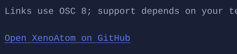

# Link

`Link` renders a hyperlink-like visual and can be activated by keyboard/mouse.




## Basic usage

```csharp
new Link("https://github.com/XenoAtom/XenoAtom.Terminal.UI", "Open project")
    .Opened(e => Terminal.WriteLine($"Opening {e.Uri}"));
```

If you don’t provide `Text`, the URI is used as the display text.

## Interaction

- Mouse click activates the link.
- `Enter` / `Space` activates the link when focused.

## Defaults

- Default alignment: `HorizontalAlignment = Align.Start`, `VerticalAlignment = Align.Start`

## Styling

`LinkStyle` controls colors/underline for normal/hover/focused states.

> [!NOTE]
> Link rendering uses terminal hyperlinks when supported (OSC 8). Terminals that don’t support hyperlinks will still
> render the link text, but activation is up to your handler.

## Related

- [Input](../input.md)
- [Styling](../styling.md)
