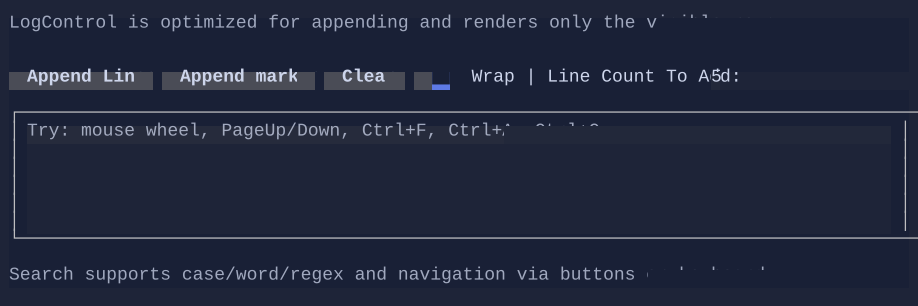

# LogControl

`LogControl` is a high-performance scrolling log viewer intended for “tail-like” workloads (frequent appends).
It supports selection + copy, a maximum retained capacity, optional wrapping, and built-in search UI.

> Screenshot: `site/img/logcontrol.png` (placeholder)




## Key features

- Append text or markup without creating a visual per line.
- Scroll with mouse wheel, `PageUp`/`PageDown`, `Home`/`End`.
- Select and copy:
  - `Ctrl+A` selects all
  - `Ctrl+C` copies the selection to the terminal clipboard
- Built-in search (`Ctrl+F`) with:
  - next/previous navigation
  - case sensitive / whole word / regex options

## Basic usage

```csharp
var log = new LogControl
{
    MaxCapacity = 2000,
}.WrapText(true);

log.AppendLine("Starting…");
log.AppendMarkupLine("[green]✔[/] Ready");
```

## Built-in search

Press `Ctrl+F` while the control is focused to open the search popup. Matches are highlighted in the log view.
Use `Alt+Arrow` to move the popup.

You can also drive search programmatically:

```csharp
log.Search("error");
log.GoToNextMatch();
```

## Defaults

- Default alignment: `HorizontalAlignment = Align.Stretch`, `VerticalAlignment = Align.Stretch` 

## Styling
Use `LogControlStyle` and `LogControlSearchStyle` to customize colors and rendering:

```csharp
log.Style(LogControlStyle.Default with
{
    Padding = new Thickness(1, 0, 1, 0),
});
```

> Note: `WrapText` is a control property (not a style) so you can toggle it dynamically without cloning styles.
