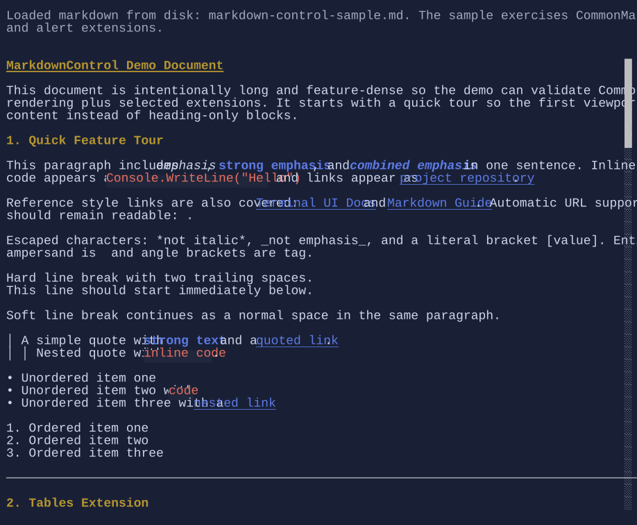

# MarkdownControl

`MarkdownControl` renders markdown using Markdig and displays the result through `DocumentFlow`.

It lives in the extension package:

```shell
dotnet add package XenoAtom.Terminal.UI.Extensions.Markdown
```

{.terminal}

## Basic usage

```csharp
using XenoAtom.Terminal.UI.Controls;
using XenoAtom.Terminal.UI.Extensions.Markdown;

var markdown = """
# Title

Paragraph with **strong** text and a [link](https://example.com).
""";

var control = new MarkdownControl(markdown);
```

`MarkdownControl` disables `DocumentFlow` follow-tail by default so documents open from the top.

## Pipeline and rendering options

`MarkdownControl` uses a default pipeline supporting CommonMark plus tables and alert blocks.

You can provide your own pipeline and rendering options:

```csharp
using Markdig;
using XenoAtom.Terminal.UI.Extensions.Markdown;

var pipeline = new MarkdownPipelineBuilder()
    .Configure("common+pipetables+alerts+tasklists")
    .Build();

var control = new MarkdownControl(markdown)
{
    Pipeline = pipeline,
    BaseUri = new Uri("https://xenoatom.github.io/terminal/docs/"),
    Options = MarkdownRenderOptions.Default with
    {
        WrapCodeBlocks = false,
        MaxCodeBlockHeight = 14,
    }
};
```

## Styling markdown

Use `RenderStyle` for role-based customization (headings, links, emphasis, alerts):

```csharp
using XenoAtom.Terminal.UI.Extensions.Markdown.Styling;

var control = new MarkdownControl(markdown)
{
    RenderStyle = MarkdownStyle.Default with
    {
        LinkStyle = Style.None | TextStyle.Bold | TextStyle.Underline,
        Heading1Style = Style.None | TextStyle.Bold | TextStyle.Underline
    }
};
```

## Related

- [DocumentFlow](documentflow.md)
- [Paragraph](paragraph.md)
- [MarkdownControl Specs](../specs/controls/markdowncontrol.md)
