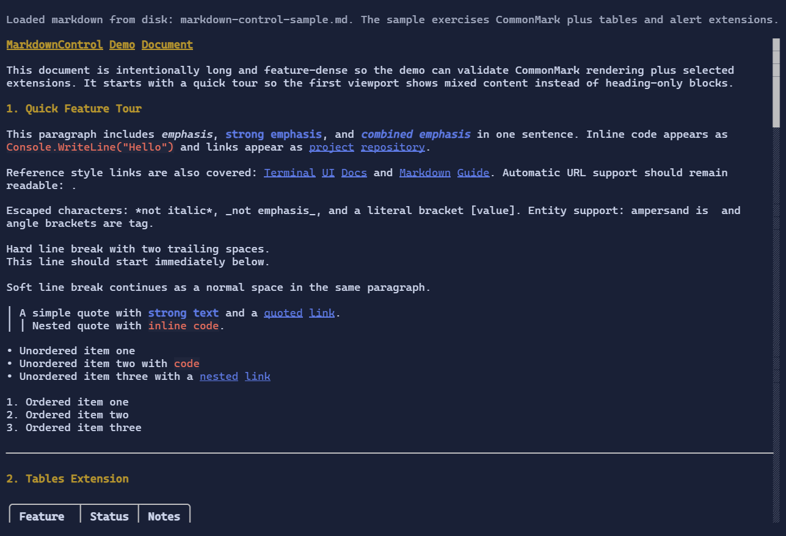

# MarkdownControl

`MarkdownControl` renders markdown using Markdig and displays the result through `DocumentFlow`.

It lives in the extension package:

```shell
dotnet add package XenoAtom.Terminal.UI.Extensions.Markdown
```

{.terminal}

## Basic usage

```csharp
using XenoAtom.Terminal.UI.Controls;
using XenoAtom.Terminal.UI.Extensions.Markdown;

var markdown = """
# Title

Paragraph with **strong** text and a [link](https://example.com).
""";

var control = new MarkdownControl(markdown);
```

`MarkdownControl` disables `DocumentFlow` follow-tail by default so documents open from the top.

## Pipeline and rendering options

`MarkdownControl` uses a default pipeline supporting CommonMark plus tables and alert blocks.

You can provide your own pipeline and rendering options:

```csharp
using Markdig;
using XenoAtom.Terminal.UI.Extensions.Markdown;

var pipeline = new MarkdownPipelineBuilder()
    .Configure("common+pipetables+alerts+tasklists")
    .Build();

var control = new MarkdownControl(markdown)
{
    Pipeline = pipeline,
    BaseUri = new Uri("https://xenoatom.github.io/terminal/docs/"),
    Options = MarkdownRenderOptions.Default with
    {
        WrapCodeBlocks = false,
        MaxCodeBlockHeight = 14,
        HeadingSpacingBefore = 0,
        HeadingSpacingAfter = 1,
        ParagraphSpacing = 1,
        BlockSpacing = 1,
    }
};
```

For Markdown documents that contain local file links, use `LocalFileRootPath` to resolve relative paths into valid local `file://` URIs:

```csharp
var control = new MarkdownControl(markdown)
{
    Options = MarkdownRenderOptions.Default with
    {
        LocalFileRootPath = Environment.CurrentDirectory,
    }
};
```

Absolute local paths such as `C:\docs\guide.md` on Windows are also normalized to `file://` links automatically.

Spacing defaults are intentionally compact for terminal density:

- heading spacing before: `0`
- heading spacing after: `1`
- paragraph spacing: `1`
- block spacing (tables/code/rules/alerts): `1`

## Custom fenced-code rendering

`MarkdownControl` exposes a code-block extension point through `MarkdownRenderOptions.CodeBlockRenderer`.
This lets you replace the default plain `LogControl` rendering for fenced or indented code blocks:

```csharp
public sealed class MyCodeBlockRenderer : IMarkdownCodeBlockRenderer
{
    public Visual? CreateVisual(in MarkdownCodeBlockRenderContext context)
    {
        if (!string.Equals(context.Language, "demo", StringComparison.OrdinalIgnoreCase))
        {
            return null; // fall back to the built-in renderer
        }

        return new TextBlock("custom renderer");
    }
}

var control = new MarkdownControl(markdown)
{
    Options = MarkdownRenderOptions.Default with
    {
        CodeBlockRenderer = new MyCodeBlockRenderer(),
    },
};
```

Returning `null` delegates back to the built-in Markdown code-block visual.

## TextMateSharp fenced-code highlighting

To syntax-highlight fenced code blocks with bundled TextMate grammars and themes, install the companion package:

```shell
dotnet add package XenoAtom.Terminal.UI.Extensions.CodeEditor.TextMateSharp
```

Then configure the Markdown renderer:

```csharp
using XenoAtom.Terminal.UI.Extensions.CodeEditor.TextMateSharp;

var control = new MarkdownControl(markdown)
{
    Options = MarkdownRenderOptions.Default with
    {
        CodeBlockRenderer = new TextMateMarkdownCodeBlockRenderer(),
        WrapCodeBlocks = false,
    },
};
```

The TextMate-backed renderer understands fenced language identifiers such as `csharp`, `json`, or `markdown`, and it
automatically selects bundled light or dark TextMate themes to match the active terminal UI theme.

## Styling markdown

Use `RenderStyle` for role-based customization (headings, links, emphasis, alerts):

```csharp
using XenoAtom.Terminal.UI.Extensions.Markdown.Styling;

var control = new MarkdownControl(markdown)
{
    RenderStyle = MarkdownStyle.Default with
    {
        LinkStyle = Style.None | TextStyle.Bold | TextStyle.Underline,
        Heading1Style = Style.None | TextStyle.Bold | TextStyle.Underline
    }
};
```

By default, `MarkdownControl` applies a theme-aware style profile:

- headings use a warning/gold-like tone for better visual hierarchy
- headings use bright yellow for better hierarchy
- strong text uses the theme accent color
- inline code uses bright red text with an adaptive tinted background
- alert blocks (`NOTE/TIP/IMPORTANT/WARNING/CAUTION`) map to semantic theme tones (primary/success/accent/warning/error)

## Related

- [DocumentFlow](documentflow.md)
- [Paragraph](paragraph.md)
- [MarkdownMarkupConverter](markdownmarkupconverter.md)
- [MarkdownControl Specs](../specs/controls/markdowncontrol.md)
