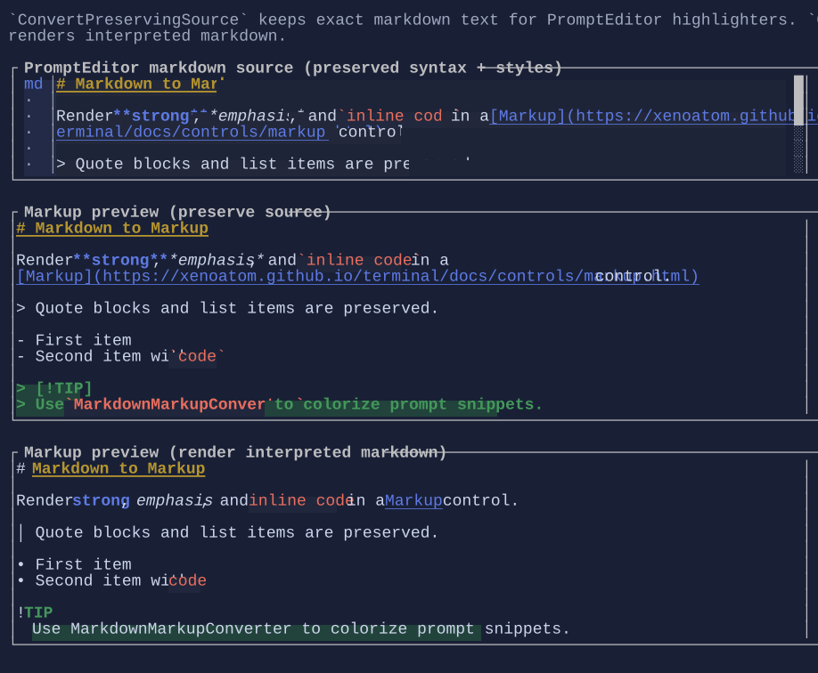

# MarkdownMarkupConverter

`MarkdownMarkupConverter` provides two modes:

- **Render mode**: converts interpreted markdown into ANSI markup (similar visual output to `MarkdownControl`)
- **Preserve-source mode**: keeps the exact original markdown text and applies styles via source spans

This makes it suitable for both `Markup` previews and `PromptEditor` syntax highlighting.

It lives in the extension package:

```shell
dotnet add package XenoAtom.Terminal.UI.Extensions.Markdown
```

{.terminal}

## Basic usage

```csharp
using XenoAtom.Terminal.UI.Controls;
using XenoAtom.Terminal.UI.Extensions.Markdown;

var converter = new MarkdownMarkupConverter();
var markupText = converter.Convert("**bold** and `code`");

var preview = new Markup(markupText).Wrap(true);
```

## Preserve-source mode (PromptEditor-ready)

Use `Highlight(...)` to get `StyledRun` spans over the **original** markdown string.

Use `ConvertPreservingSource(...)` to generate ANSI markup that keeps the exact same markdown characters (`#`, `**`, backticks, spacing, etc.).

```csharp
var converter = new MarkdownMarkupConverter();
var sourceMarkup = converter.ConvertPreservingSource(markdownText);
var sourceRuns = converter.Highlight(markdownText);
```

`Highlight(...)` is designed for controls such as `PromptEditor`, where text must stay unchanged while styles update.

## Theme-aware defaults

The converter uses the same role-based defaults as `MarkdownControl`:

- headings use bright yellow
- strong text uses accent/primary theme tones
- inline code uses bright red with themed background tint
- links use accent/primary underline styling

Set `Theme` to align output with your app theme:

```csharp
var converter = new MarkdownMarkupConverter
{
    Theme = Theme.FromScheme(ColorScheme.ElderberryDarkSoft),
};
```

## Custom pipeline and options

You can provide a custom Markdig pipeline and rendering options:

```csharp
var converter = new MarkdownMarkupConverter
{
    Pipeline = new MarkdownPipelineBuilder().Configure("common+tasklists").Build(),
    RenderOptions = MarkdownRenderOptions.Default with
    {
        RenderHtmlInlinesAsText = true,
        RenderImagesAsLinks = true,
    },
};
```

For preserve-source highlighting, you can also set `SourcePipeline`.
If you provide your own source pipeline, call `UsePreciseSourceLocation()` on the builder so inline spans are precise.

## Allocation behavior

`MarkdownMarkupConverter` reuses an internal `StringBuilder` when you call `Convert(string)`, so repeated conversions avoid re-allocating the conversion buffer.

It also supports reusable destination paths:

- `Convert(string?, StringBuilder)`
- `ConvertPreservingSource(string?, StringBuilder)`
- `Highlight(string?, List<StyledRun>)`

## Related

- [Markup](markup.md)
- [MarkdownControl](markdowncontrol.md)
- [PromptEditor](prompteditor.md)
