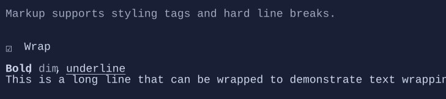

# Markup

`Markup` renders XenoAtom.Terminal markup text as a visual (with wrapping and styling).


{.terminal}

## Basic usage

```csharp
new Markup("[bold]Hello[/] [gray]world[/]!");
```

## Notes

- Markup is parsed using the XenoAtom.Terminal markup parser.
- Use `Markup` when you want inline color and text styles without building a full visual tree.

## Defaults

- Default alignment: `HorizontalAlignment = Align.Start`, `VerticalAlignment = Align.Start` 

## Related
- [Markup Parsing](../markup-parsing.md)
- [Styling](../styling.md)
- [Markup Specs](../specs/controls/markup.md)
