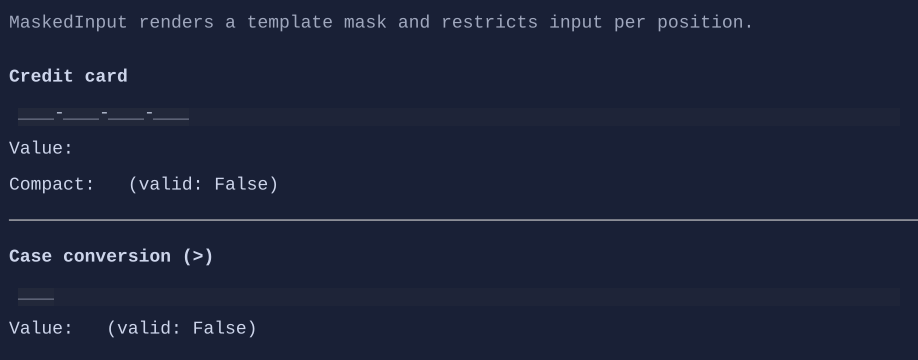

# MaskedInput

`MaskedInput` is a template-based single-line editor for structured values such as credit cards, dates, identifiers, etc.


{.terminal}

## Basic usage

```csharp
new MaskedInput("9999-9999-9999-9999;_");
```

The mask is always visible: literal separators from the template are always drawn, and unfilled slots render as a placeholder.
When the template includes the `;c` suffix, the placeholder is `c` for all empty slots. Otherwise, the placeholder glyphs are
selected from the current `MaskedInputStyle` (for example digits use `MaskedInputStyle.DigitPlaceholderChar`).

## Template format

The `Template` is a string where:

- **Token characters** describe an editable position with a per-character constraint.
- Any other character is treated as a **literal separator**.
- Use `\` to escape token characters so they are treated as literals.
- The template can end with `;c` to specify the placeholder character for empty slots.
  When omitted, placeholders are chosen per token kind from the current `MaskedInputStyle`.

### Token characters

| Token | Allowed characters | Required |
|------:|--------------------|:--------:|
| `A` | `[A-Za-z]` | Yes |
| `a` | `[A-Za-z]` | No |
| `N` | `[A-Za-z0-9]` | Yes |
| `n` | `[A-Za-z0-9]` | No |
| `X` | any non-space | Yes |
| `x` | any non-space | No |
| `9` | `[0-9]` | Yes |
| `0` | `[0-9]` | No |
| `D` | `[1-9]` | Yes |
| `d` | `[1-9]` | No |
| `#` | `[0-9+-]` | No |
| `H` | `[A-Fa-f0-9]` | Yes |
| `h` | `[A-Fa-f0-9]` | No |
| `B` | `[0-1]` | Yes |
| `b` | `[0-1]` | No |

### Case conversion directives

The following characters affect how subsequent user input is normalized:

- `>` converts subsequent user input to uppercase
- `<` converts subsequent user input to lowercase
- `!` disables automatic case conversion

These directive characters are not displayed as part of the template.

## Value and validation

`MaskedInput.Value` stores the slot characters only (separators and placeholders are not included). It is positional:
index 0 corresponds to the first editable slot, index 1 to the second, etc. Empty slots are represented by a space
character and trailing empty slots are trimmed.

`MaskedInput.CompactValue` returns the current value with empty slots removed.

`MaskedInput.IsValid` returns `true` when all required positions are filled and all filled characters satisfy the template.

```csharp
var card = new MaskedInput("9999-9999-9999-9999;_");

new VStack(
    card,
    new TextBlock(() => $"Value: {card.Value}"),
    new TextBlock(() => $"Compact: {card.CompactValue}"),
    new TextBlock(() => $"Valid: {card.IsValid}")
).Spacing(1);
```

## Undo / redo

MaskedInput supports undo/redo:

- `Ctrl+Z`: undo
- `Ctrl+R`: redo

See [Undo/Redo](../undo-redo.md).

## Defaults

- Default alignment: `HorizontalAlignment = Align.Start`, `VerticalAlignment = Align.Start` 

## Styling
`MaskedInput` uses `MaskedInputStyle` (derived from `TextBoxStyle`) for padding and background fill. Placeholder and
separator foregrounds are also configurable. The style also controls the placeholder glyphs used when the template does not
specify a `;c` suffix.
