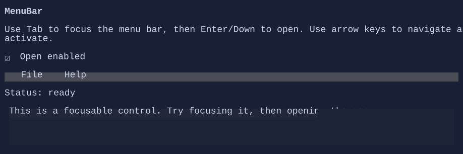

# MenuBar

`MenuBar` provides application chrome with menus and keyboard navigation.




## Fullscreen-only

Menus are implemented as popups and require a fullscreen `Terminal.Run(...)` app.

## Usage

Use `MenuItem` to build menus and submenus. Menu interaction supports keyboard and mouse.

Menu items can be backed by a `Command`:

```csharp
using XenoAtom.Terminal;
using XenoAtom.Terminal.UI.Commands;
using XenoAtom.Terminal.UI.Controls;
using XenoAtom.Terminal.UI.Input;

var open = new Command
{
    Id = "App.Open",
    LabelMarkup = "[primary]Open[/]",
    Gesture = new KeyGesture(TerminalChar.CtrlO, TerminalModifiers.Ctrl),
    Presentation = CommandPresentation.Menu,
    Execute = _ => { /* ... */ },
};

var menuBar = new MenuBar();
menuBar.Items.Add(new MenuItem("File")
    .Items(
        new MenuItem("Open", open),
        MenuItem.Separator(),
        new MenuItem("Exit", () => { /* ... */ })));
```

When `MenuItem.Command` is set:

- enabled state is derived from `Command.CanExecuteFor(...)`
- the shortcut label is derived from `Command.Gesture` / `Command.Sequence` unless `MenuItem.Shortcut` is explicitly set

## Popup chrome

Menus are displayed in `Popup` windows. You can customize the chrome around the menu list (e.g. add/remove a border) by
overriding `MenuListStyle.PopupTemplateFactory` via the visual environment:

```csharp
using XenoAtom.Terminal.UI.Styling;

menuBar.Style(MenuListStyle.Default with
{
    PopupTemplateFactory = null, // no wrapper
});
```


## Defaults

- Default alignment: `HorizontalAlignment = Align.Start`, `VerticalAlignment = Align.Start` 
