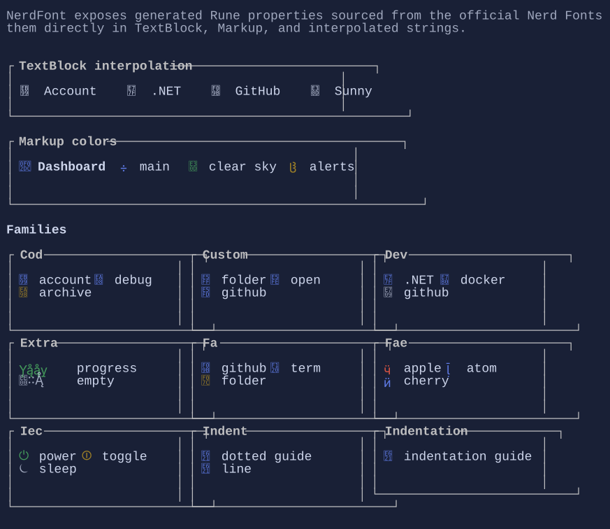

# NerdFont

`NerdFont` is a generated helper class that exposes official Nerd Fonts glyph names as `Rune` properties.

The API lives in the main `XenoAtom.Terminal.UI` namespace, so the glyphs are easy to use from `TextBlock`, `Markup`,
`Paragraph`, and string interpolation.

{.terminal}

> [!NOTE]
> To see the expected glyphs in your terminal, use a font that includes Nerd Fonts symbols.
> Without a compatible font, the runes may appear as fallback squares or replacement glyphs.

## Basic usage

```csharp
using XenoAtom.Terminal.UI;
using XenoAtom.Terminal.UI.Controls;

var title = new TextBlock($"{NerdFont.CodAccount}  Account settings");
var branch = new TextBlock($"{NerdFont.PlBranch} main");
```

## With Markup

`Rune` properties also work naturally inside markup strings:

```csharp
var status = new Markup(
    $"[primary]{NerdFont.MdHome}[/] Home  " +
    $"[accent]{NerdFont.FaGithub}[/] GitHub  " +
    $"[success]{NerdFont.WeatherDaySunny}[/] Ready");
```

## Width profiles

Terminal.UI widens Nerd Font glyphs by default through `TerminalWideRuneResolvers.Default`, which matches the common
`NF` installation where Nerd Font symbols render as double-width.

If your terminal uses **Nerd Font Mono** (`NFM`), switch the app to `TerminalWideRuneResolvers.NerdFontMono` so the
generated icon runes stay single-width:

```csharp
Terminal.Run(
    root,
    onUpdate,
    new TerminalRunOptions
    {
        WideRuneResolver = TerminalWideRuneResolvers.NerdFontMono,
    });
```

For inline/live hosting, use the same property on `TerminalLiveOptions`.

> [!NOTE]
> Proportional Nerd Font setups (`NFP`) are not supported by Terminal.UI layout, because the framework assumes a
> fixed cell grid.

## Naming

Property names follow the family prefix from the official Nerd Fonts metadata:

- `CodAccount`
- `MdHome`
- `OctMarkGithub`
- `WeatherDaySunny`

Internally the generated code is split across multiple partial files for maintainability, but the public API is a single
`NerdFont` class.

## Source and coverage

The generated properties come from the official `glyphnames.json` file published by Nerd Fonts. The current generated set
covers the full upstream catalog exposed by that file, including families such as Codicons, Material Design, Octicons,
Powerline, Weather Icons, Seti, and more.

## Related

- [Markup](markup.md)
- [TextBlock](textblock.md)
- [Paragraph](paragraph.md)
