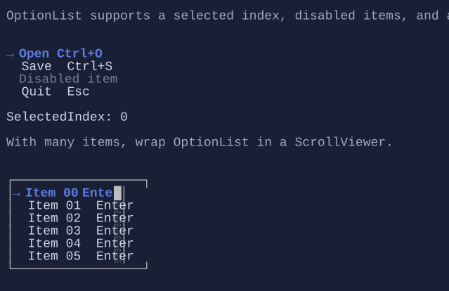

# OptionList

`OptionList<T>` is a single-choice list widget optimized for keyboard/mouse selection.


{.terminal}

## Basic usage

```csharp
new OptionList<string>()
    .Items(["First", "Second"]);
```

## Selection and activation

`OptionList<T>` is single-selection (`SelectedIndex`) and can raise activation events.

Keyboard:

- `Up` / `Down`, `PageUp` / `PageDown`, `Home` / `End`: navigate the selection
- `Enter` / `Space`: activate the selected item
- Type-to-jump: typing letters jumps to the next matching item (via `ItemSearchText`)

Mouse:

- Click selects an item.
- Click (optional) also activates when `ActivateOnClick` is enabled.
- Wheel moves selection.

## Disabled items

Use `ItemIsEnabled` to disable certain rows (they remain visible but cannot be selected/activated):

```csharp
new OptionList<string>()
    .Items(["Open", "Save", "Exit"])
    .ItemIsEnabled(item => item != "Save");
```

## Templates

Like other list controls, `OptionList<T>` uses `DataTemplate<T>` to render items.
If you don’t set `ItemTemplate`, the template is resolved from the environment (`DataTemplates`).

## Defaults

- Default alignment: `HorizontalAlignment = Align.Start`, `VerticalAlignment = Align.Start` 

## Styling
`OptionListStyle` controls marker glyphs, spacing, hover/selection styles, and layout details.

## Related

- [Data Templating](../data-templating.md)
- [Binding](../binding.md)
- [ScrollViewer](scrollviewer.md)
