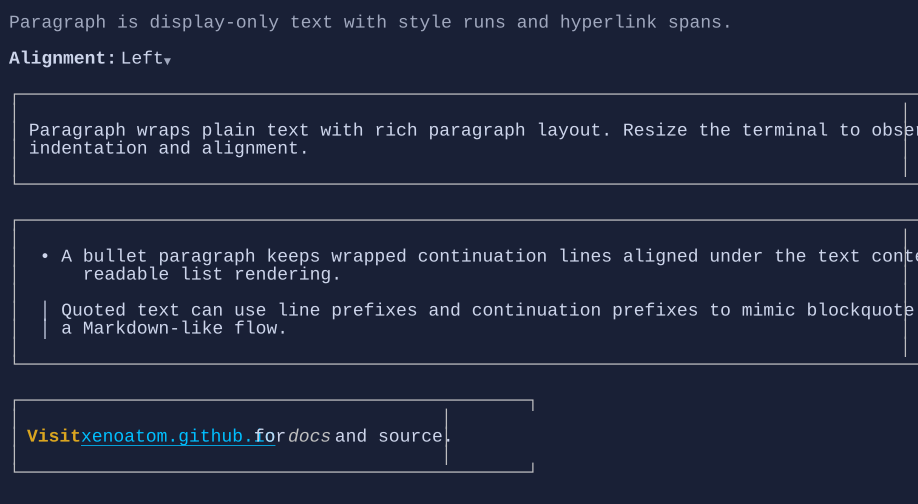

# Paragraph

`Paragraph` renders display-only rich text from plain text plus style runs and hyperlink runs.
It is intended for document-like content where `TextBlock` is too limited and `Markup` parsing is not desired.

{.terminal}

## Basic usage

```csharp
new Paragraph("Hello paragraph")
    .Wrap(true);
```

## Prefixes and hanging indent

```csharp
new Paragraph("Wrapped list item text")
    .Indent(1)
    .HangingIndent(2)
    .LinePrefix("• ")
    .ContinuationPrefix("  ");
```

## Style runs and hyperlinks

```csharp
var text = "Visit xenoatom.github.io";

new Paragraph(text)
{
    Runs =
    [
        new StyledRun(0, 5, Style.None | TextStyle.Bold),
        new StyledRun(6, 18, Style.None | TextStyle.Underline),
    ],
    Hyperlinks =
    [
        new HyperlinkRun(6, 18, "https://xenoatom.github.io/terminal/docs/"),
    ],
};
```

## Mouse selection and copy

`Paragraph` supports mouse drag selection. After selecting text with the left mouse button, press `Ctrl+C` to copy the selected text to the clipboard.

## Behavior defaults

- `Wrap = true`
- `TextAlignment = TextAlignment.Left`
- `Trimming = TextTrimming.Clip`
- `Indent = 0`, `HangingIndent = 0`
- `Runs = Array.Empty<StyledRun>()`, `Hyperlinks = Array.Empty<HyperlinkRun>()`

## Related

- [TextBlock](textblock.md)
- [Markup](markup.md)
- [Paragraph Specs](../specs/controls/paragraph.md)
