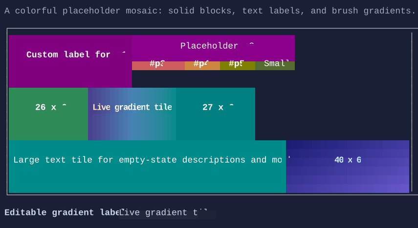

# Placeholder

`Placeholder` is a lightweight visual surface for mockups and empty states. It can render with text, without text,
or as a gradient block using the brush model.

{.terminal}

## Basic usage

```csharp
new Placeholder();

new Placeholder("No results");
```

## Dynamic text

```csharp
var message = new State<string?>("No data");

new Placeholder(message);
```

## Background-only placeholder

```csharp
new Placeholder()
    .MinWidth(20)
    .MinHeight(6)
    .Style(PlaceholderStyle.Default with
    {
        Background = Colors.SlateBlue,
    });
```

## Gradient foreground and background

```csharp
new Placeholder("Loading...")
    .HorizontalAlignment(Align.Stretch)
    .Style(PlaceholderStyle.Default with
    {
        ForegroundBrush = Brush.LinearGradient(
            new GradientPoint(0f, 0f),
            new GradientPoint(1f, 0f),
            [new GradientStop(0f, Colors.White), new GradientStop(1f, Colors.LightSkyBlue)]),
        BackgroundBrush = Brush.LinearGradient(
            new GradientPoint(0f, 0f),
            new GradientPoint(1f, 1f),
            [new GradientStop(0f, Colors.MidnightBlue), new GradientStop(1f, Colors.SteelBlue)]),
        TextStyle = TextStyle.Bold,
        Padding = new Thickness(1),
    });
```

## Behavior defaults

- `Wrap = true`
- `TextAlignment = TextAlignment.Center`
- `VerticalTextAlignment = Align.Center`
- `Trimming = TextTrimming.Clip`
- `PlaceholderStyle.FillBackground = true`

## Related

- [Gradients](gradients.md)
- [Styling](../styling.md)
- [Placeholder Specs](../specs/controls/placeholder.md)
