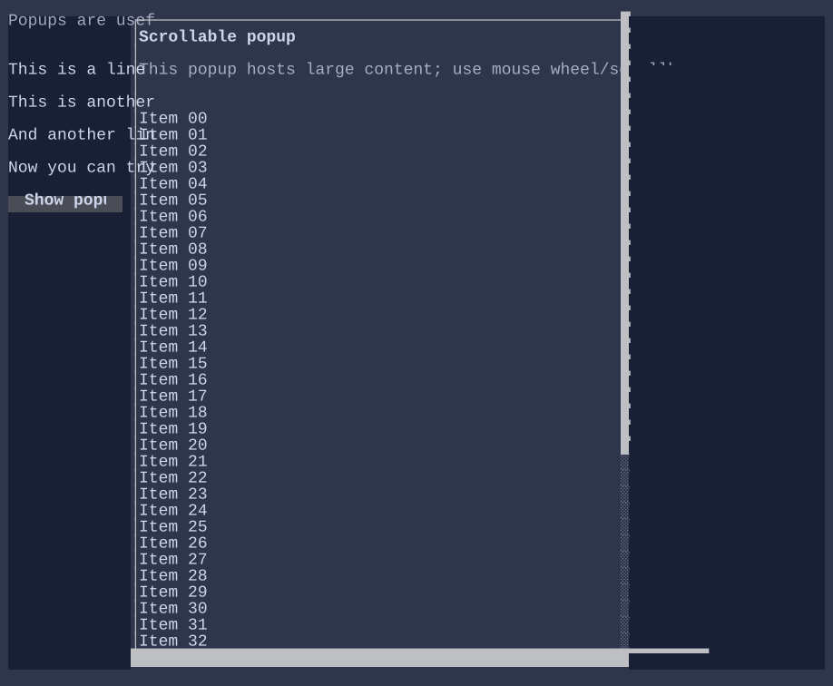

# Popup

`Popup` is an overlay surface used for dropdowns, context menus, and lightweight transient UI.

Popups close when focus is lost or when the user clicks outside (depending on configuration).

{.terminal}

## Anchoring

Popups can be positioned relative to:

- an anchor visual (via `Popup.Anchor`), or
- an explicit rectangle in UI coordinates (via `Popup.AnchorRect`).

`AnchorRect` is primarily used for point-based popups such as context menus (right-click), where there is no natural anchor
visual to align to.

## Typical usage

- `Select<T>` uses a popup for its dropdown list.
- `ContextMenu` uses a popup anchored to the click position.
- `SearchReplacePopup` uses a popup-like overlay anchored within an editor.

## Focus and dismissal

Popups participate in focus. Common dismissal patterns:

- close on `Escape`,
- close when clicking outside,
- close when the popup loses focus (for transient UI).

> [!IMPORTANT]
> When you show a popup from a control, keep the focus rules explicit: decide whether focus should move into the popup
> (typical for menus) or remain on the originating control (typical for passive tooltips).

## Defaults

- Default alignment: `HorizontalAlignment = Align.Start`, `VerticalAlignment = Align.Start` 

## Related
- [Dialog](dialog.md)
- [ContextMenu](contextmenu.md)
- [Select](select.md)
- [Tooltip](tooltip.md)
