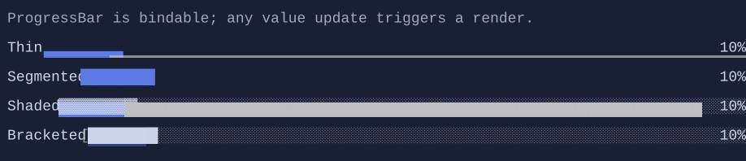

# ProgressBar

`ProgressBar` renders a progress bar using different variants (thin, shaded, segmented, bracketed).


{.terminal}

## Basic usage

```csharp
var progress = new State<double>(0.66);
new ProgressBar().Value(progress);
```

## Defaults

- Default alignment: `HorizontalAlignment = Align.Stretch`, `VerticalAlignment = Align.Start` 

## Styling
`ProgressBarStyle` controls variants, glyphs, and color palette.

If you want to display a label, a percentage, or a spinner next to a progress bar, use `ProgressTaskGroup`.
