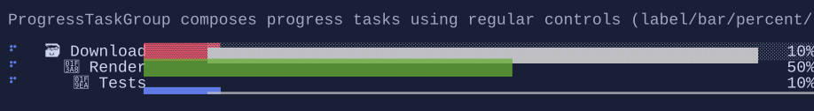

# ProgressTaskGroup

`ProgressTaskGroup` displays a set of progress tasks as rows with configurable columns (label, progress bar, percentage, spinner…).




## Basic usage

```csharp
var work = new ProgressTask("Work");
var download = new ProgressTask("Download") { Maximum = 1024 };

var group = new ProgressTaskGroup()
    .Tasks([work, download]);

// Update progress values from your update loop:
work.Value = 0.5;
download.Value = 512;
```

## Per-task styling

Tasks can customize how their cells are built per column (for example, to color a specific bar differently than the rest).

```csharp
var download = new ProgressTask("Download")
    .StyleBar(ProgressBarStyle.Bracketed);
```

## Columns

You can reorder, replace, or add columns using `ProgressTaskGroup.Columns`.

```csharp
var group = new ProgressTaskGroup()
    .Columns([
        ProgressTaskColumns.Spinner(),
        ProgressTaskColumns.Label(),
        ProgressTaskColumns.Bar(),
        ProgressTaskColumns.Percentage(),
    ]);
```

To create a custom column, build visuals from the provided task:

```csharp
var etaColumn = new ProgressTaskColumn(task => new TextBlock(() => $"v={task.Value:0.##}"));

var group = new ProgressTaskGroup()
    .Columns([ProgressTaskColumns.Label(), etaColumn, ProgressTaskColumns.Bar()]);
```

## Defaults

- Default alignment: `HorizontalAlignment = Align.Stretch`, `VerticalAlignment = Align.Start` 
