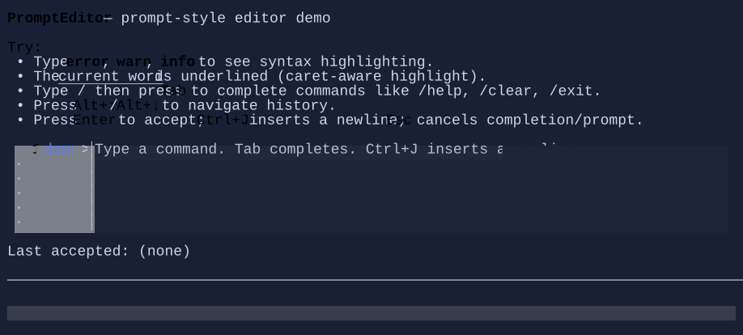

# PromptEditor

`PromptEditor` is a prompt-style text editor built on top of the `TextEditorBase` / `TextEditorCore` infrastructure.

It is designed for REPLs and terminal prompts where you want:

- a prompt prefix (markup),
- multi-line editing,
- completion (ghost + popup/cycling),
- prompt-oriented accept/cancel actions,
- optional syntax highlighting.

{.terminal}

## Basic usage

```csharp
var command = new State<string?>(string.Empty);

var editor = new PromptEditor()
    .Text(command)
    .PromptMarkup("[primary]demo[/] [muted]>[/] ")
    .Placeholder("Type a command… (Tab completes)");
```

## Enter vs Ctrl+J (new line)

By default:

- `Enter` **accepts**
- `Ctrl+J` inserts a newline (`\n`)

You can swap these behaviors:

```csharp
new PromptEditor()
    .EnterMode(PromptEditorEnterMode.EnterInsertsNewLine);
```

## Syntax highlighting

`PromptEditor` supports lightweight, pluggable syntax highlighting via a delegate that produces style runs:

```csharp
new PromptEditor()
    .Highlighter((in PromptEditorHighlightRequest request, List<StyledRun> runs) =>
    {
        // Use request.Snapshot and add StyledRun(start, length, style) entries.
        // request.CaretIndex / request.Selection* are provided for caret-aware highlighting.
    });
```

## Completion

Completion is pluggable via `CompletionHandler`:

```csharp
new PromptEditor()
    .CompletionPresentation(PromptEditorCompletionPresentation.PopupList)
    .CompletionHandler(request =>
    {
        // Compute candidates for request.Snapshot at request.CaretIndex...
        return new PromptEditorCompletion(
            Handled: true,
            Candidates: new[] { "help", "clear", "exit" },
            ReplaceStart: 0,
            ReplaceLength: request.CaretIndex,
            GhostText: "elp");
    });
```

Default behavior:

- `Tab` requests completion (unless `AcceptTab=true`).
- `Esc` cancels completion (or cancels the prompt if no completion UI is active).

## Prompt prefix

`PromptEditor` renders the prompt prefix in a dedicated left column:

- `PromptMarkup` is rendered on the first visual row
- `ContinuationPromptMarkup` is rendered for continuation rows

If `ContinuationPromptMarkup` is empty, the control keeps the column width but does not draw text.

### Prompt as a visual

For richer prompts (icons, spinners, widgets…), you can provide a visual prompt:

```csharp
new PromptEditor()
    .Prompt(new HStack(
        new Spinner().MinWidth(1),
        new Markup("[primary]demo[/] [muted]>[/] ")));
```

When `Prompt` is set, it takes precedence over `PromptMarkup` on the first visual row. Continuation rows still use
`ContinuationPromptMarkup` (or indentation if empty).

## Commands (CommandBar)

`PromptEditor` registers prompt-specific commands so a `CommandBar` can surface shortcuts:

- `PromptEditor.Accept`
- `PromptEditor.Cancel`
- `PromptEditor.InsertNewLine`
- `PromptEditor.Complete`
- `PromptEditor.HistoryPrevious` / `PromptEditor.HistoryNext`

It also inherits `TextEditor.*` commands from `TextEditorBase` (undo/redo/copy/paste/select-all, etc.).

## Defaults

- Default alignment: `HorizontalAlignment = Align.Stretch`, `VerticalAlignment = Align.Stretch`

## See also

- [Text Editing](../text-editing.md)
- [Binding](../binding.md)
- [Styling](../styling.md)
- [PromptEditor specs](../specs/controls/prompteditor.md)
