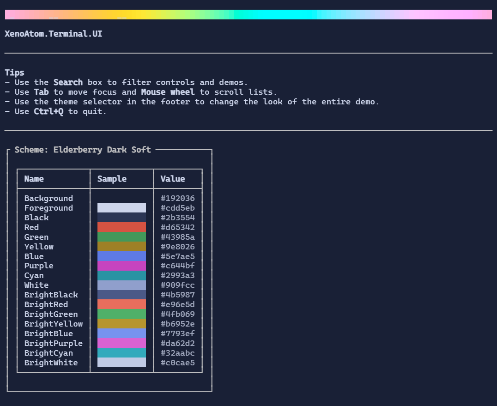

# Controls Reference

This section documents the built-in controls provided by XenoAtom.Terminal.UI.

{.terminal}

> [!NOTE]
> Most pages include an auto-generated screenshot from `samples/ControlsDemo`.
>
> The rendering on the website may differ slightly from the actual control appearance in your terminal environment, due to the fact that it is a SVG export.
> The terminal will better represent the control visuals.
>
> Regenerate them with `dotnet run -c Release --project samples/ControlsDemo -- --export-screenshots`.

## <i class="bi bi-keyboard xenoatom-icon xenoatom-icon--input" aria-hidden="true"></i> Text input

- [TextBox](textbox.md)
- [TextArea](textarea.md)
- [PromptEditor](prompteditor.md)
- [SearchReplacePopup](searchreplacepopup.md)
- [MaskedInput](maskedinput.md)
- [NumberBox](numberbox.md)
- [ColorPicker](colorpicker.md)
- [Validation](validation.md)

## <i class="bi bi-toggle-on xenoatom-icon xenoatom-icon--actions" aria-hidden="true"></i> Buttons & toggles

- [Button](button.md)
- [CheckBox](checkbox.md)
- [RadioButton](radiobutton.md)
- [Switch](switch.md)

## <i class="bi bi-list-check xenoatom-icon xenoatom-icon--lists" aria-hidden="true"></i> Lists & selection

- [ListBox](listbox.md)
- [SelectionList](selectionlist.md)
- [OptionList](optionlist.md)
- [Select](select.md)
- [TreeView](treeview.md)

## <i class="bi bi-layout-split xenoatom-icon xenoatom-icon--layout" aria-hidden="true"></i> Layout & containers

- [VStack](vstack.md)
- [HStack](hstack.md)
- [WrapStack](wrapstack.md)
- [Grid](grid.md)
- [DockLayout](docklayout.md)
- [Center](center.md)
- [Padder](padder.md)
- [Border](border.md)
- [Group](group.md)
- [Splitter](splitter.md)

## <i class="bi bi-arrows-move xenoatom-icon xenoatom-icon--scroll" aria-hidden="true"></i> Scrolling

- [ScrollViewer](scrollviewer.md)
- [ScrollBar](scrollbar.md)

## <i class="bi bi-window xenoatom-icon xenoatom-icon--chrome" aria-hidden="true"></i> Navigation & chrome

- [TabControl](tabcontrol.md)
- [MenuBar](menubar.md)
- [Header](header.md)
- [Footer](footer.md)
- [StatusBar](statusbar.md)
- [CommandBar](commandbar.md)
- [CommandPalette](commandpalette.md)

## <i class="bi bi-table xenoatom-icon xenoatom-icon--data" aria-hidden="true"></i> Data display

- [Table](table.md)
- [DataGridControl](datagrid.md)
- [TextBlock](textblock.md)
- [Markup](markup.md)
- [Rule](rule.md)
- [Link](link.md)
- [LogControl](logcontrol.md)
- [ProgressBar](progressbar.md)
- [ProgressTaskGroup](progresstaskgroup.md)
- [Spinner](spinner.md)
- [BreakdownChart](breakdownchart.md)
- [BarChart](barchart.md)
- [LineChart](linechart.md)
- [Sparkline](sparkline.md)
- [Canvas](canvas.md)
- [TextFiglet](textfiglet.md)

## <i class="bi bi-layers xenoatom-icon xenoatom-icon--overlays" aria-hidden="true"></i> Overlays

- [Popup](popup.md)
- [ContextMenu](contextmenu.md)
- [Dialog](dialog.md)
- [Tooltip](tooltip.md)
- [Backdrop](backdrop.md)
- [Toast](toast.md)

