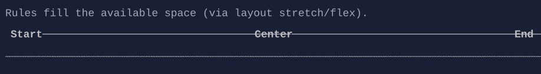

# Rule

`Rule` renders a horizontal separator line.

Rule is horizontal-only.




## Basic usage

```csharp
new VStack(
    "Section A",
    new Rule(),
    "Section B");
```

`Rule` can optionally render labels:

```csharp
new Rule()
    .StartLabel("Left")
    .CenterLabel("Center")
    .EndLabel("Right");
```

## Defaults

- Default alignment: `HorizontalAlignment = Align.Stretch`, `VerticalAlignment = Align.Start`

## Styling

`RuleStyle` controls line glyphs and label padding.

## Related

- [Styling](../styling.md)
