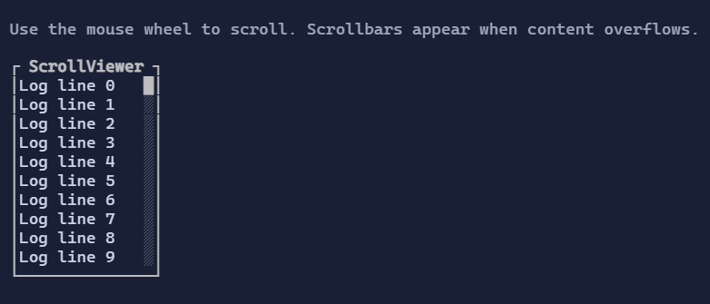

# ScrollViewer

`ScrollViewer` provides a viewport with optional horizontal/vertical scrollbars for any content.


{.terminal}

## Basic usage

```csharp
new ScrollViewer(new VStack(
    "Line 1",
    "Line 2",
    "Line 3"
));
```

`ScrollViewer` is typically used as the outer container around long content:

```csharp
new Border(
    new ScrollViewer(new TextArea("... lots of text ..."))
        .MinHeight(8)
        .MaxHeight(8));
```

## Content implementing `IScrollable`

If `Content` implements `IScrollable`, ScrollViewer delegates scrolling to the content’s `ScrollModel`.
This enables controls like `TextArea` to own their own extent and viewport logic.

If `Content` does **not** implement `IScrollable`, `ScrollViewer` provides an internal scroll model and performs
viewport clipping/offsetting automatically.

> [!IMPORTANT]
> `IScrollable` is the recommended contract for any control that has intrinsic scrolling behavior
> (text editors, virtualized lists/grids). It allows:
> - consistent scrollbar behavior,
> - keyboard + wheel scrolling support,
> - nested scroll composition without guessing content size.

## Scroll bar visibility

`HorizontalScrollBarVisibility` and `VerticalScrollBarVisibility` control when each scroll bar is displayed:

- `ScrollBarVisibility.Auto` displays the bar only when content exceeds the viewport. This is the default.
- `ScrollBarVisibility.Hidden` hides the bar while preserving keyboard, pointer, and programmatic scrolling.
- `ScrollBarVisibility.Always` always displays the bar and reserves its space in the content viewport.

For example, use an always-visible vertical bar when content should keep a stable layout width as its extent changes:

```csharp
new ScrollViewer(content)
    .VerticalScrollBarVisibility(ScrollBarVisibility.Always);
```

When a bar is `Always` or `Hidden`, its viewport contribution is known before content layout, so ScrollViewer does not
need additional passes to determine that bar's visibility. Bars configured as `Auto` still use layout convergence when
one bar can affect overflow on the other axis. Setting `HorizontalScrollEnabled` or `VerticalScrollEnabled` to `false`
disables scrolling and hides the corresponding bar regardless of its visibility setting.

## Interaction

- Mouse wheel scrolls the closest `ScrollViewer` under the pointer.
- `Shift + wheel` (when supported by the host) scrolls horizontally.
- Scrollbars can be clicked to jump to a position or dragged continuously; they can be focused for keyboard interaction.
- When a `ScrollViewer` is only a wrapper around an interactive child, set `IsTabStop = false` to skip the wrapper during `Tab` / `Shift+Tab` focus traversal while keeping it focusable for mouse or programmatic focus.

## Layout behavior (viewport vs extent)

ScrollViewer distinguishes:

- **Viewport**: how much space is currently available to display content.
- **Extent**: how large the scrollable content is (in terminal cells).

When the extent exceeds the viewport, ScrollViewer:

- clamps scroll offsets,
- displays the relevant scrollbars (when enabled),
- reserves space for the scrollbars so content does not render under them.

> [!TIP]
> If you expect scrollbars to appear, prefer bounding one axis (`MinHeight/MaxHeight` or `MinWidth/MaxWidth`)
> so the control has a reason to clip and scroll.

## Defaults

- Default alignment: `HorizontalAlignment = Align.Stretch`, `VerticalAlignment = Align.Stretch` 
- Default scroll bar visibility: `HorizontalScrollBarVisibility = ScrollBarVisibility.Auto`, `VerticalScrollBarVisibility = ScrollBarVisibility.Auto`

## Styling
`ScrollViewerStyle` controls scrollbar thickness and color palette.
`ScrollBarStyle` controls track/thumb colors and glyphs.

## Related

- [Scrolling](../scrolling.md)
- [ScrollBar](scrollbar.md)
- [ScrollViewer Specs](../specs/controls/scrollviewer.md)
