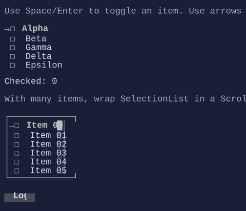

# SelectionList

`SelectionList<T>` is a multi-select list widget (checkbox-style selection in-layout).




## Basic usage

```csharp
new SelectionList<string>()
    .AddItem("First")
    .AddItem("Second", isChecked: true);
```

## Items and checked state

`SelectionList<T>` exposes:

- `Items`: the list of items
- `Checked`: a parallel `BindableList<bool>` holding the checked state for each item (same index as `Items`)

This makes it easy to bind selection state to your own models:

```csharp
var items = new[] { "A", "B", "C" };
var checkedState = new State<bool[]>([true, false, false]);
```

> [!NOTE]
> The control keeps `Checked` aligned with `Items` (same count). Missing entries default to `false`.

## Navigation and selection

Keyboard:

- `Up` / `Down`, `PageUp` / `PageDown`, `Home` / `End`: move the selection cursor
- `Space` / `Enter`: toggle the selected item
- `Ctrl+A`: check all
- `Ctrl+I`: invert all

Mouse:

- Click selects an item (and can toggle depending on style/interaction).

## Templates

Like other list controls, items are rendered using `DataTemplate<T>`.
If you don’t set `ItemTemplate`, the template is resolved from the environment (`DataTemplates`).

## Defaults

- Default alignment: `HorizontalAlignment = Align.Start`, `VerticalAlignment = Align.Start` 

## Styling
`SelectionListStyle` controls glyphs, spacing, and selection visuals.

## Related

- [Data Templating](../data-templating.md)
- [Binding](../binding.md)
- [ScrollViewer](scrollviewer.md)
