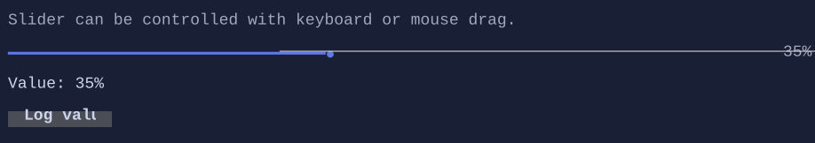

# Slider

`Slider` selects a value in a range and supports mouse/keyboard interaction.


{.terminal}

## Basic usage

```csharp
var value = new State<int>(25);
new Slider().Minimum(0).Maximum(100).Value(value);
```

## Interaction

- Arrow keys adjust the value by a small step.
- PageUp/PageDown adjust by a larger step.
- Mouse click/drag moves the thumb.

## Defaults

- Default alignment: `HorizontalAlignment = Align.Stretch`, `VerticalAlignment = Align.Start` 

## Styling
`SliderStyle` controls track/thumb glyphs and colors.

## Related

- [Binding](../binding.md)
- [Styling](../styling.md)
