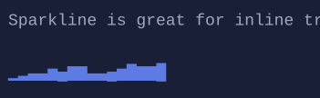

# Sparkline

`Sparkline` renders an inline sparkline visualization.


{.terminal}

## Basic usage

```csharp
new Sparkline()
    .Values([1, 4, 2, 5, 3, 6]);
```

## Notes

- `Sparkline` is a single-line chart (height is always 1).
- Values are downsampled to the available width (spikes are preserved).

## Defaults

- Default alignment: `HorizontalAlignment = Align.Start`, `VerticalAlignment = Align.Start`

## Styling

`SparklineStyle` controls the glyph set and colors.

## Related

- [LineChart](linechart.md)
- [Styling](../styling.md)
