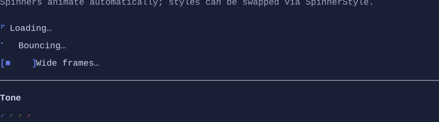

# Spinner

`Spinner` is an animated indicator control with a large set of built-in styles.

Screenshot placeholder:



## Basic usage

```csharp
new Spinner().Style(SpinnerStyles.Dots);
```

## Custom styles

Spinner styles define frames (strings) and a frame rate. Frames can be multi-rune strings.

## Defaults

- Default alignment: `HorizontalAlignment = Align.Start`, `VerticalAlignment = Align.Start` 

See also:
- `src/XenoAtom.Terminal.UI/Styling/SpinnerStyle.cs`
- `src/XenoAtom.Terminal.UI/Styling/SpinnerStyles.cs`

