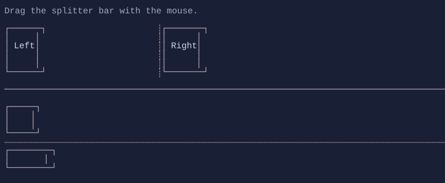

# Splitter (HSplitter / VSplitter)

Splitters resize adjacent content panes using mouse drag.


{.terminal}

## Basic usage

```csharp
new HStack(
    leftPane,
    new VSplitter(),
    rightPane
);
```

`SplitterStyle` controls handle glyphs and colors.


## Defaults

- Default alignment: `HorizontalAlignment = Align.Start`, `VerticalAlignment = Align.Start` 

## Related

- [Splitter (HSplitter / VSplitter) Specs](../specs/controls/splitter.md)
