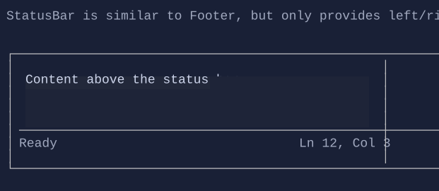

# StatusBar

`StatusBar` is a footer-like control for status text and key hints.

You may prefer `Header`/`Footer` for new apps.



## Basic usage

```csharp
new StatusBar()
    .LeftText("Ready")
    .RightText("Ctrl+Q quit");
```

## Defaults

- Default alignment: `HorizontalAlignment = Align.Stretch`, `VerticalAlignment = Align.Start`

## Related

- [Header](header.md)
- [Footer](footer.md)
