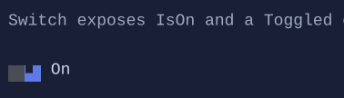

# Switch

`Switch` is a compact on/off toggle with a thumb and label.




## Basic usage

```csharp
var enabled = new State<bool>(true);
new Switch("Enabled").IsOn(enabled);
```

## Defaults

- Default alignment: `HorizontalAlignment = Align.Start`, `VerticalAlignment = Align.Start` 

## Styling
`SwitchStyle` controls:

- left/right segment colors
- thumb glyph
- background/foreground for normal/hover/pressed/disabled

## Interaction

- `Space` / `Enter`: toggle when focused.
- Mouse click: toggle.

## Related

- [Binding](../binding.md)
- [Styling](../styling.md)
