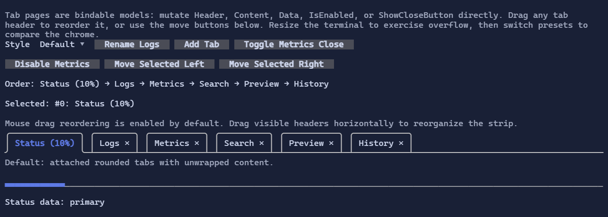

# TabControl

`TabControl` hosts multiple tab pages with clickable headers.
Tab headers are visuals, enabling rich header content (icons, counters, dynamic text, etc.).
`TabPage` is now a bindable model, so you can update a page's `Header`, `Content`, `IsEnabled`, `ShowCloseButton`, or `Data`
without removing and recreating the tab.

{.terminal}

## Basic usage

```csharp
var logs = new TabPage("Logs", "Tail -f output")
{
    ShowCloseButton = true,
    Data = "logs",
};

logs.RequestClosing += (_, e) =>
{
    if (HasPendingSave())
    {
        e.Cancel = true;
    }
};

var tabs = new TabControl(
    new TabPage("Status", "Ready"),
    logs,
    new TabPage("Metrics", "42 req/s") { ShowCloseButton = true });
```

## Defaults

- Default alignment: `HorizontalAlignment = Align.Stretch`, `VerticalAlignment = Align.Stretch`
- The default style renders attached rounded tabs over a separator line instead of boxing the selected content.
- Tab headers stay on a single line. When they do not fit, overflow buttons appear at the far left and far right.
- Drag reordering is enabled by default for visible tab headers and can be disabled with `AllowTabDragReorder`.

## Tab pages

`TabPage` exposes bindable state:

- `Header : Visual`
- `Content : Visual`
- `IsEnabled : bool`
- `ShowCloseButton : bool`
- `Data : object?`

Close lifecycle:

- `RequestClosing` lets a page cancel a close request.
- `Closed` is raised after the page has been removed.
- `TabControl.TryCloseTab(...)` closes a page programmatically and uses the same lifecycle as the close button.
- `TabControl.MoveTab(...)` / `TryMoveTab(...)` reorders existing pages while keeping the same selected page selected.

## Reordering tabs

Use the programmatic move APIs when you want to wire tab reordering to hotkeys or commands:

```csharp
tabs.MoveTab(oldIndex: 3, newIndex: 1);
tabs.TryMoveTab(currentPage, newIndex: 0);
```

When `AllowTabDragReorder` is `true` (the default), users can also drag a visible tab header horizontally to reorder it with the mouse.

## Styling

`TabControlStyle` controls header rendering, close buttons, overflow buttons, separator/frame glyphs, and the optional content wrapper.

By default:

- selected tabs use accent/focus styling on the attached tab header
- close buttons inherit the tab style, then switch to an error-toned hover/pressed state
- overflow buttons use the tab/button surface styling
- the selected content is not wrapped in an extra border

Use `TabControlStyle.Compact` for a tighter single-line attached look, or `TabControlStyle.Legacy` to restore the original flat strip + boxed content layout.

```csharp
new TabControl(
    new TabPage("Status", "Ready"),
    new TabPage("Logs", "…") { ShowCloseButton = true })
    .Style(TabControlStyle.Default with
    {
        CloseButtonRune = new Rune('x'),
        OverflowPreviousRune = new Rune('<'),
        OverflowNextRune = new Rune('>'),
    });

new TabControl(
    new TabPage("Status", "Ready"),
    new TabPage("Logs", "…"))
    .Style(TabControlStyle.Compact);

new TabControl(
    new TabPage("Status", "Ready"),
    new TabPage("Logs", "…"))
    .Style(TabControlStyle.Legacy);
```

## Interaction

- Mouse click on a tab header activates the tab.
- Dragging a visible tab header reorders it when `AllowTabDragReorder` is enabled.
- Clicking a close button requests tab closure and may be cancelled by the page.
- When tabs overflow, left/right overflow buttons scroll the visible header window.
- `Left` / `Right` arrow keys switch between enabled tabs when the control is focused.
- `SelectionChanged` is raised whenever the effective selected tab changes, including when closing the active tab changes the selected page without changing the numeric index.

```csharp
tabs.SelectionChanged((_, e) =>
{
    if (e.NewPage is not null)
    {
        StartLoadingForTab(e.NewPage);
    }
});
```

## Related

- [Styling](../styling.md)
- [Layout](../layout.md)
- [TabControl Specs](../specs/controls/tabcontrol.md)
