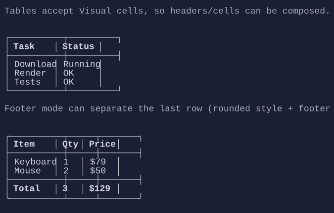

# Table

`Table` displays a grid of cells. Cells and headers are visuals for full composability.


{.terminal}

## Basic usage

```csharp
new Table()
    .Headers("Task", "Status")
    .AddRow("Download", "Running")
    .AddRow("Render", "OK");
```

## Defaults

- Default alignment: `HorizontalAlignment = Align.Start`, `VerticalAlignment = Align.Start` 

## Styling
`TableStyle` controls border glyphs, header style, separators, and line visibility.

## Footer row

You can mark the last row as a footer:

```csharp
new Table()
    .Headers("Item", "Amount")
    .AddRow("Subtotal", "$10.00")
    .AddRow("Total", "$10.00")
    .LastRowIsFooter(true)
    .ShowFooterSeparator(true);
```

- `LastRowIsFooter` treats the final body row as a footer row.
- `ShowFooterSeparator` inserts a separator before the footer row when row separators are not already enabled.

## Notes

- `Table` is best for relatively small datasets where you want rich per-cell visuals.
- Row height is computed from the tallest cell in the row, so multi-line visuals (e.g. `VStack`, `TextArea`) work as expected.
- For very large datasets, prefer `DataGridControl` (virtualized, scrollable, selection/search/editing).

## Related

- [DataGridControl](datagrid.md)
- [Layout](../layout.md)
- [Styling](../styling.md)
- [Table Specs](../specs/controls/table.md)
