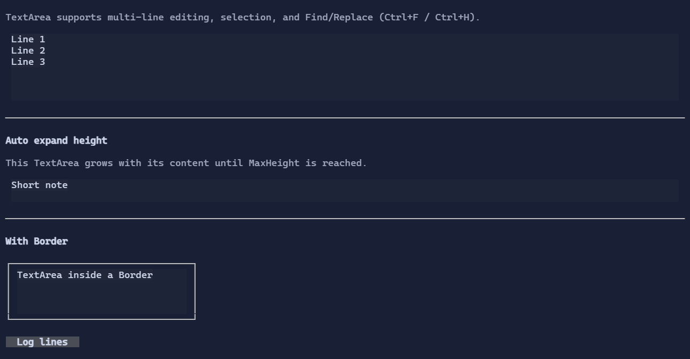

# TextArea

`TextArea` is a multi-line text editor with soft wrapping by default.


{.terminal}

## Basic usage

```csharp
new TextArea("Hello\nWorld");
```

To two-way bind to a `State<string>`:

```csharp
var text = new State<string>("Hello\nWorld");
new TextArea().Text(text);
```

## Find / Replace

`TextArea` includes a built-in Find / Replace popup:

- `Ctrl+F`: Find
- `Ctrl+H`: Replace

See also [SearchReplacePopup](searchreplacepopup.md).

## Auto-expand height

To let a `TextArea` grow with its content instead of keeping the default fixed height, enable auto-sizing on the shared text-editor base:

```csharp
new TextArea()
    .Text(text)
    .AutoSizeMode(TextEditorAutoSizeMode.Height)
    .MinHeight(2)
    .MaxHeight(8);
```

The control expands vertically until it reaches its normal layout limits (for example `MaxHeight` or a bounded parent slot).

## Undo / redo

TextArea supports undo/redo:

- `Ctrl+Z`: undo
- `Ctrl+R`: redo

Replace operations are undoable. `Replace All` is recorded as a single undo step.

See [Undo/Redo](../undo-redo.md).

## Scroll integration

TextArea implements `IScrollable`, so it integrates with `ScrollViewer`:

```csharp
new ScrollViewer(new TextArea(longText));
```

When you bound the control (e.g. with `.MaxHeight(...)`) the scroll model provides an extent larger than the viewport,
and the viewer can render scrollbars and synchronize offsets.

## Defaults

- Default alignment: `HorizontalAlignment = Align.Start`, `VerticalAlignment = Align.Start` 

## Styling
`TextAreaStyle` controls colors, padding, and selection rendering.

See also:

- [Text Editing](../text-editing.md)
- [Binding](../binding.md)
- [ScrollViewer](scrollviewer.md)

## Related

- [TextArea Specs](../specs/controls/textarea.md)
